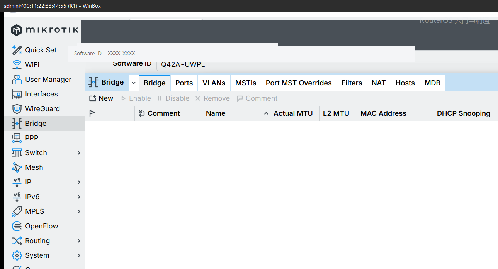

# WireGuard

> 适用版本：RouterOS 7.x  
> 管理工具：WinBox  
> 官方依据：[WireGuard](https://help.mikrotik.com/docs/spaces/ROS/pages/69664792/WireGuard)

## 目的

建 wg-demo 接口，做回家 VPN 底座。

## 网络

- 示例 LAN：`192.168.88.0/24`，网关 `192.168.88.1`，接口 `bridge`（改成你的口）
- WAN 示例：`pppoe-out1` 或 `ether1`
- 密码示例：`********`（填你自己的管理员密码）
- 身份示例：`R1`

## 第1步：新建 WireGuard

WinBox：`WireGuard → +`

动作：Name=wg-demo，Listen Port=13231。



```routeros
/interface/wireguard/add name=wg-demo listen-port=13231
```

## 第2步：加地址

WinBox：`IP → Addresses → +`

动作：Address=10.10.10.1/24，Interface=wg-demo。


```routeros
/ip/address/add address=10.10.10.1/24 interface=wg-demo
```

## 第3步：打开 Peers

WinBox：`WireGuard → Peers`

动作：准备添加手机/电脑 Peer；公钥用占位符。


```routeros
/interface/wireguard/peers/print
```

## 检查

WinBox：wg-demo 为 R

```routeros
/interface/wireguard/print
/interface/wireguard/peers/print
```

## 常见问题

光猫要转发 UDP 13231。
