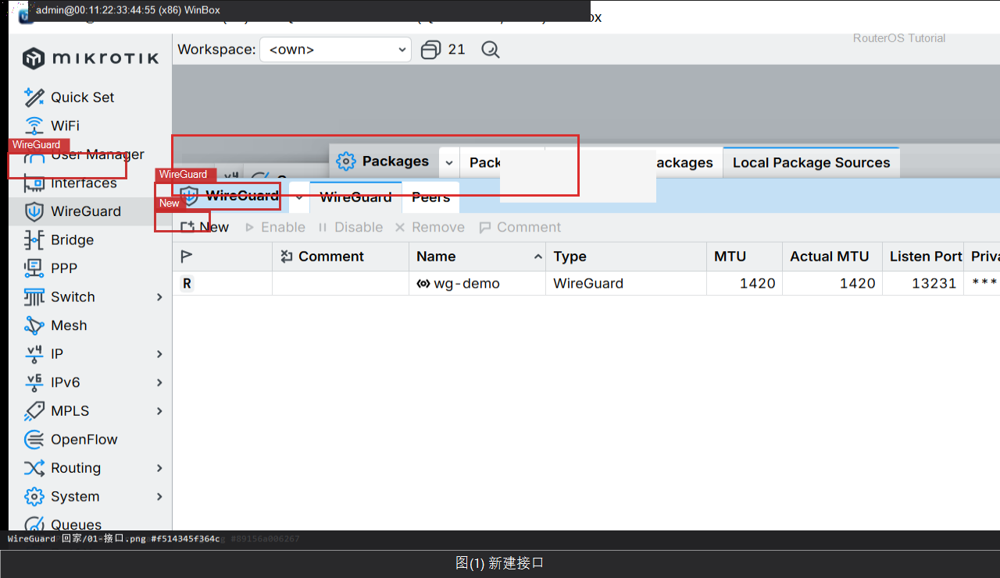
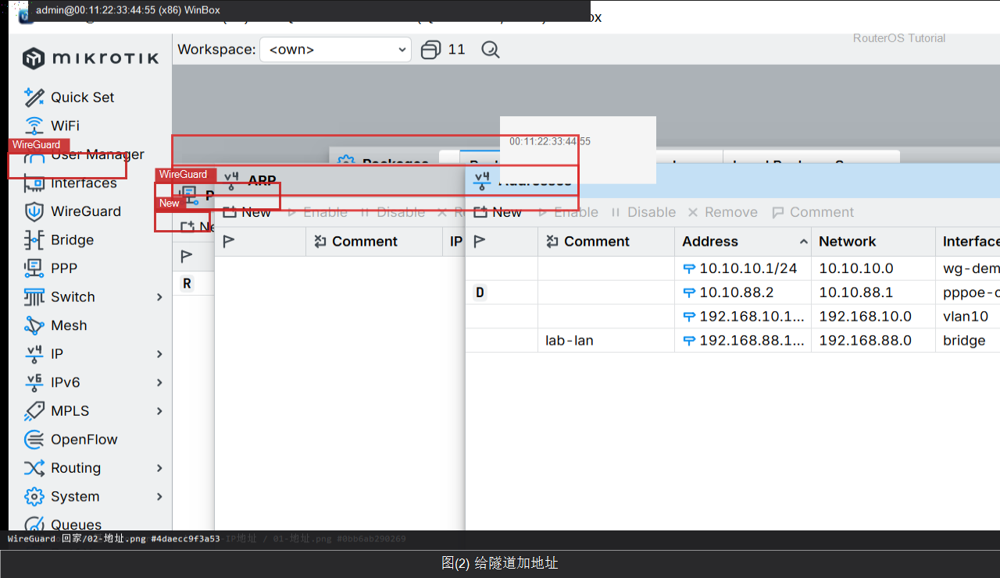
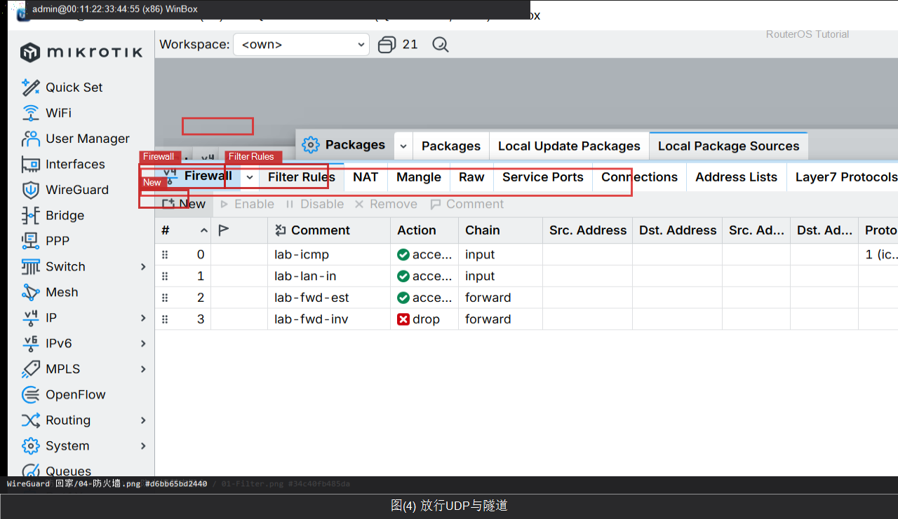
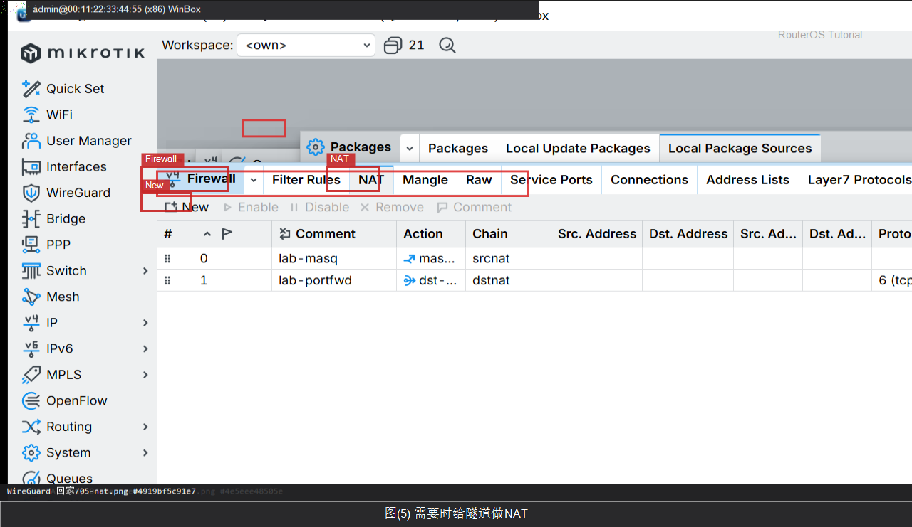

# WireGuard 回家

> 适用版本：RouterOS 7.x


## 目的

从建接口到手机/电脑能进家里 LAN，一次配完。

## 网络

- LAN：`192.168.88.0/24`，网关 `192.168.88.1`，接口 `bridge`（改成你的口）
- WAN：`pppoe-out1` 或 `ether1`
- 公网示例用 TEST-NET：`203.0.113.10`；密码只写 `********`
- 身份示例：`R1`
- 隧道网段：`10.10.10.0/24`，路由器 `10.10.10.1`，手机 `10.10.10.2`
- 监听 UDP `13231`（光猫要转发到这台路由器）
- 公钥示例：`BASE64PUBLICKEY=======`（填双方真实公钥，勿写私钥）

## 第1步：新建接口

WinBox：`WireGuard → +`

动作：Name=wg-home，Listen Port=13231。OK 后记下本机公钥（Private Key 不要外传）。



```routeros
/interface/wireguard/add name=wg-home listen-port=13231
/interface/wireguard/print
```

## 第2步：给隧道加地址

WinBox：`IP → Addresses → +`

动作：Address=10.10.10.1/24，Interface=wg-home。



```routeros
/ip/address/add address=10.10.10.1/24 interface=wg-home
```

## 第3步：添加手机 Peer

WinBox：`WireGuard → Peers → +`

动作：Interface=wg-home，Public Key=手机公钥，Allowed Address=10.10.10.2/32，Persistent Keepalive=25s。


```routeros
/interface/wireguard/peers/add interface=wg-home public-key="BASE64PUBLICKEY=======" allowed-address=10.10.10.2/32 persistent-keepalive=25s comment=phone
```

## 第4步：放行 UDP 与隧道

WinBox：`IP → Firewall → Filter Rules → +`

动作：input：UDP 13231 accept；forward：进/出 wg-home 放行 LAN。



```routeros
/ip/firewall/filter/add chain=input protocol=udp dst-port=13231 action=accept comment=lab-wg-in
/ip/firewall/filter/add chain=forward in-interface=wg-home action=accept comment=lab-wg-fwd
```

## 第5步：需要时给隧道做 NAT

WinBox：`IP → Firewall → NAT → +`

动作：若手机要经路由器上网：Chain=srcnat，Out. Interface=pppoe-out1，Src. Address=10.10.10.0/24，Action=masquerade。只进 LAN 可跳过。



```routeros
/ip/firewall/nat/add chain=srcnat src-address=10.10.10.0/24 out-interface=pppoe-out1 action=masquerade comment=lab-wg-masq
```

## 检查

WinBox：wg-home 为 R；Peer 有 Last Handshake

```routeros
/interface/wireguard/print
/interface/wireguard/peers/print
/ping 10.10.10.2 count=4
```

## 常见问题

容易忽略：光猫转发 UDP 13231。手机 AllowedIPs 至少含 10.10.10.0/24 和 192.168.88.0/24。Endpoint 填你家公网或 DDNS。
