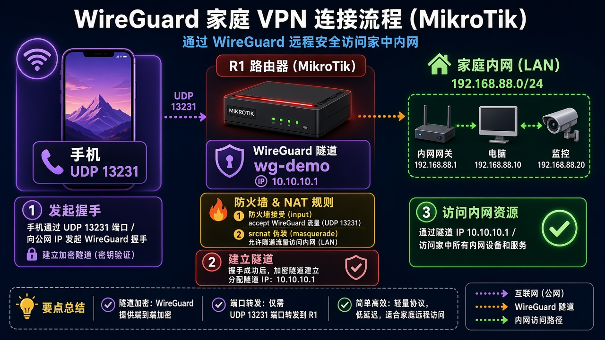
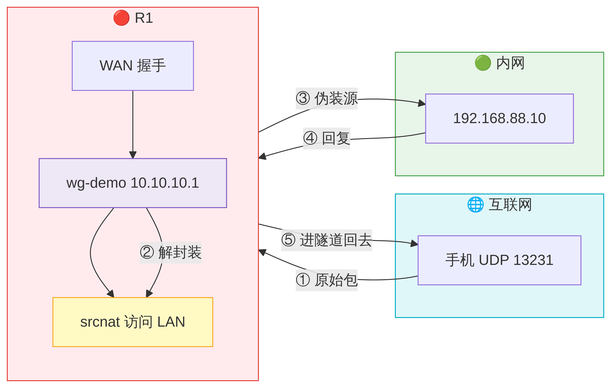
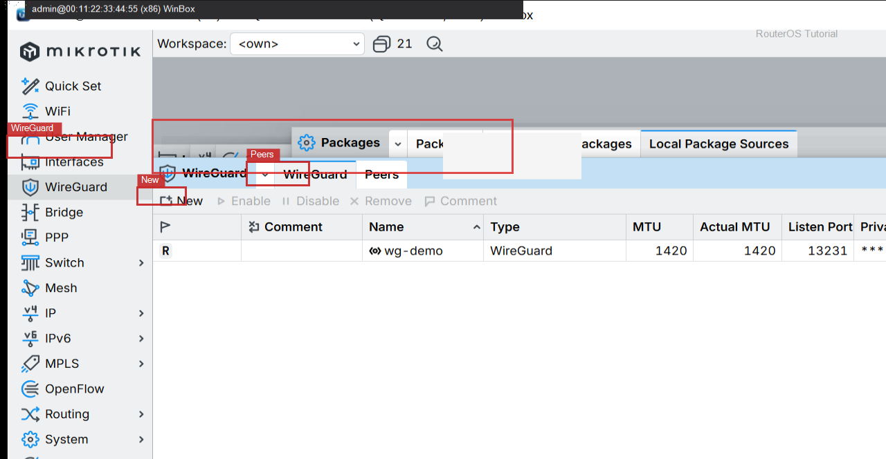
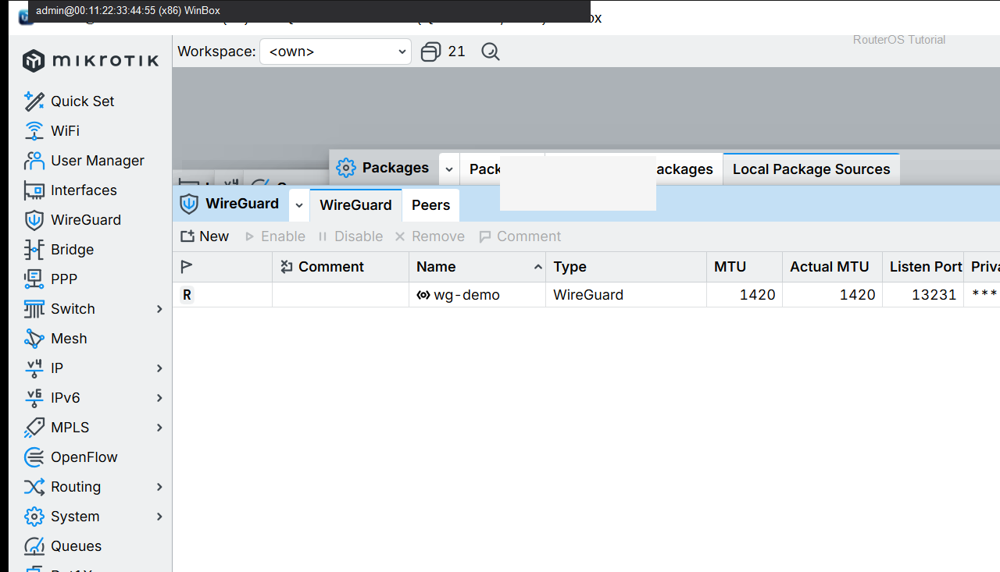

# WireGuard 手机

> 适用版本：RouterOS 7.x

## 目的

手机连回家。

## 网络

- 示例 LAN：`192.168.88.0/24`，网关 `192.168.88.1`，接口 `bridge`（改成你的口）
- WAN 示例：`pppoe-out1` 或 `ether1`
- 密码示例：`********`（填你自己的管理员密码）
- 身份示例：`R1`
- Endpoint 示例：`203.0.113.50:13231`（TEST-NET）
- 公钥示例：`BASE64PUBLICKEY=======`


## 先看懂

手机填：家里公钥、Endpoint、AllowedIPs。



<p align="center">图(1) 手机Peer</p>



<p align="center">图(2) 数据包变形</p>


## 第1步：核对服务端

WinBox：`WireGuard`

动作：wg-demo Running，有 Listen Port。



<p align="center">图(3) 核对服务端</p>


```routeros
/interface/wireguard/print
```

## 第2步：添加/核对 Peer

WinBox：`WireGuard → Peers`

动作：Public Key、Allowed Address、Endpoint 按对端填写（勿写真实私钥）。



<p align="center">图(4) 添加/核对Peer</p>


```routeros
/interface/wireguard/peers/print
```

## 检查

WinBox：Peer 有握手或能 ping 隧道地址

```routeros
/interface/wireguard/peers/print
```

## 常见问题

容易忽略：手机 AllowedIPs 按你需要填。
