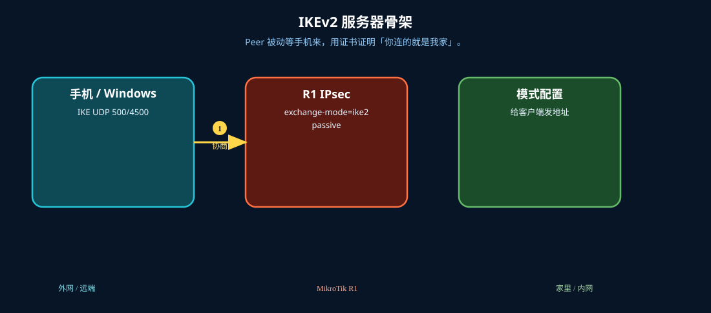
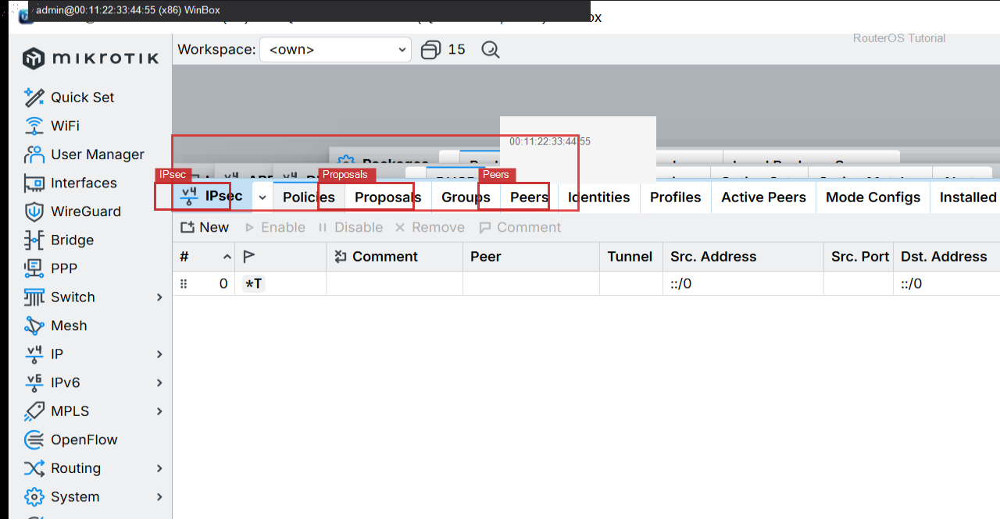
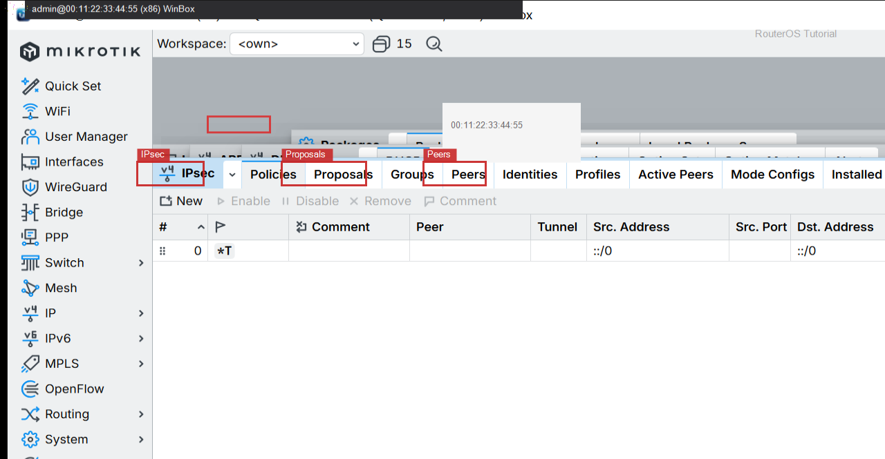

# IKEv2 服务器

> 适用版本：RouterOS 7.x

## 目的

看 IPsec 配置入口（证书课另做）。

## 网络

- 示例 LAN：`192.168.88.0/24`，网关 `192.168.88.1`，接口 `bridge`（改成你的口）
- WAN 示例：`pppoe-out1` 或 `ether1`
- 密码示例：`********`（填你自己的管理员密码）
- 身份示例：`R1`

## 先看懂

Peer 被动等手机来，用证书证明「你连的就是我家」。



<p align="center">图(0) IKEv2服务器</p>

## 第1步：打开 IPsec

WinBox：`IP → IPsec`

动作：认 Peers / Identities / Policies 页签。



<p align="center">图(1) 打开IPsec</p>


```routeros
/ip/ipsec/peer/print
```

## 第2步：看 Profiles

WinBox：`IP → IPsec → Profiles`

动作：确认加密提案存在。



<p align="center">图(2) 看Profiles</p>


```routeros
/ip/ipsec/profile/print
```

## 检查

WinBox：能打开 IPsec 窗口

```routeros
/ip/ipsec/peer/print
/ip/ipsec/profile/print
```

## 常见问题

容易忽略：完整 IKEv2 还需证书与 Identity。
