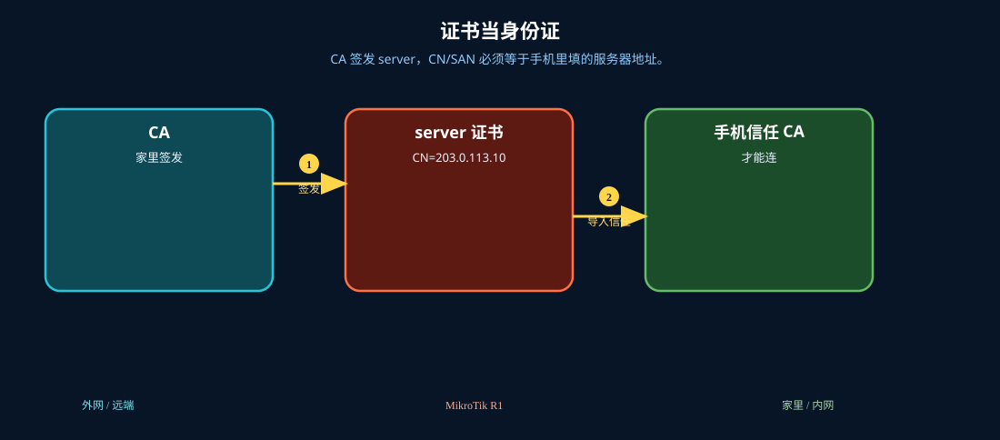
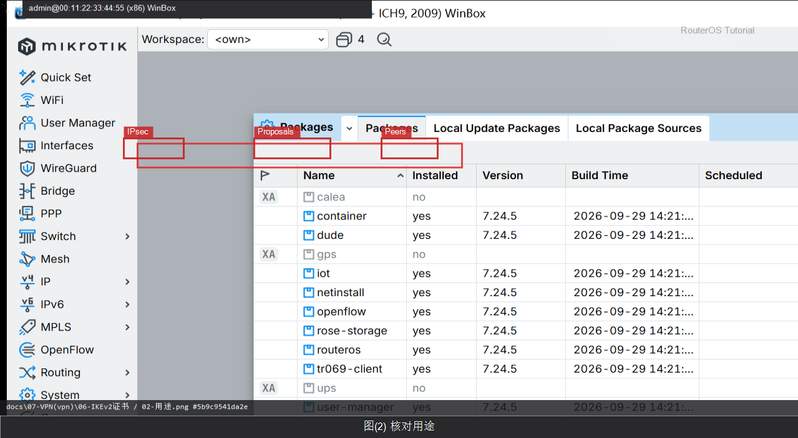

# IKEv2 证书

> 适用版本：RouterOS 7.x

## 目的

证书用于 IKEv2 身份校验。

## 网络

- 示例 LAN：`192.168.88.0/24`，网关 `192.168.88.1`，接口 `bridge`（改成你的口）
- WAN 示例：`pppoe-out1` 或 `ether1`
- 密码示例：`********`（填你自己的管理员密码）
- 身份示例：`R1`

## 先看懂

CA 签发 server，CN/SAN 必须等于手机里填的服务器地址。



## 第1步：打开 Certificates

WinBox：`System → Certificates`

动作：查看已有证书列表。


```routeros
/certificate/print
```

## 第2步：核对用途

WinBox：`System → Certificates`

动作：CA/服务器证书用途正确后再配 IPsec Identity。



```routeros
/certificate/print detail
```

## 检查

WinBox：证书列表可读

```routeros
/certificate/print
```
