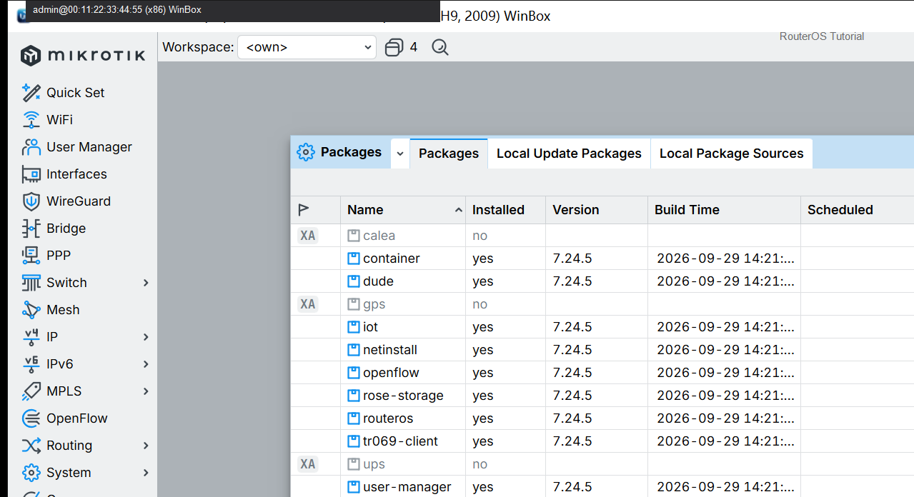

# IKEv2 证书

> 适用版本：RouterOS 7.x  
> 管理工具：WinBox  
> 官方依据：[Certificates](https://help.mikrotik.com/docs/spaces/ROS/pages/2555947/Certificates)

## 目的

IKEv2 常用证书认证。

## 网络

- 示例 LAN：`192.168.88.0/24`，网关 `192.168.88.1`，接口 `bridge`
- WAN 示例：`pppoe-out1` 或 `ether1`
- 密码示例：`********`（填你自己的）
- 身份示例：`R1`

## 第1步：打开证书

WinBox：`System → Certificates`

动作：导入或自签 CA/服务器证书（名称勿含个人信息）。



```routeros
/certificate/print
```

## 检查

WinBox：Certificates 有可用证书

```routeros
/certificate/print
```

## 常见问题

手机要信任你的 CA。
