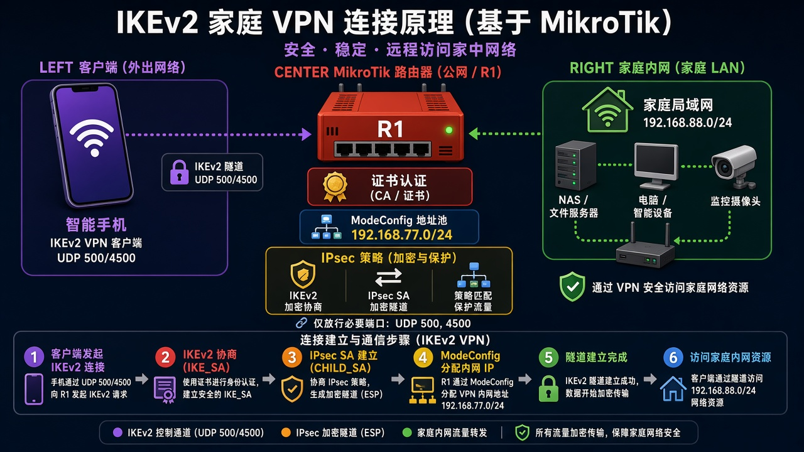
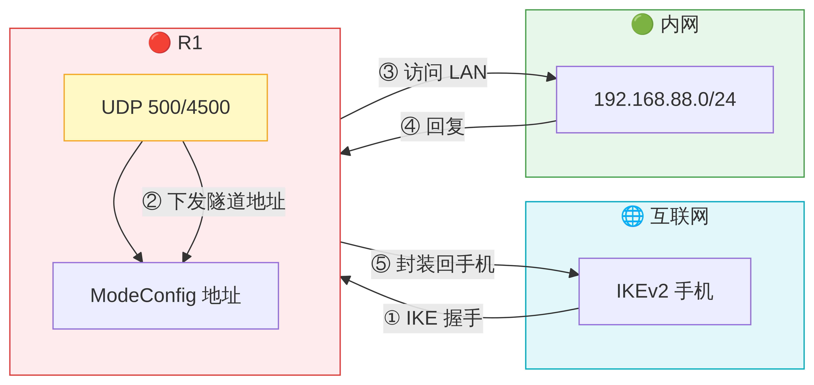
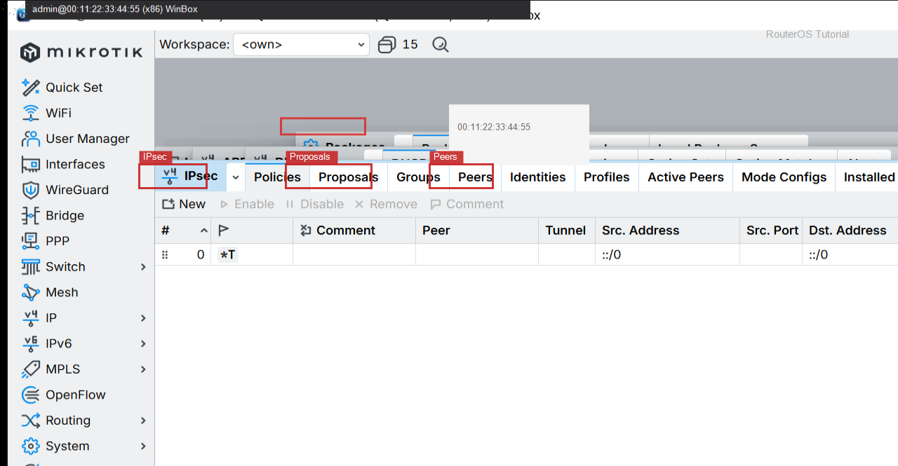

# IKEv2 手机

> 适用版本：RouterOS 7.x

## 目的

在路由器侧核对 IPsec 策略/对端。

## 网络

- 示例 LAN：`192.168.88.0/24`，网关 `192.168.88.1`，接口 `bridge`（改成你的口）
- WAN 示例：`pppoe-out1` 或 `ether1`
- 密码示例：`********`（填你自己的管理员密码）
- 身份示例：`R1`
- 对端示例：`203.0.113.60`（TEST-NET）


## 先看懂

服务器地址、CA、用户/证书三者对上才会亮。



<p align="center">图(1) IKEv2手机</p>



<p align="center">图(2) 数据包变形</p>


## 第1步：打开 IPsec

WinBox：`IP → IPsec`

动作：看 Peers/Policies。


<p align="center">图(3) 打开IPsec</p>


```routeros
/ip/ipsec/peer/print
```

## 第2步：看 Active Peers / SA

WinBox：`IP → IPsec → Active Peers`

动作：连上后这里会有 SA。



<p align="center">图(4) 看ActivePeers/SA</p>


```routeros
/ip/ipsec/active-peers/print
/ip/ipsec/installed-sa/print
```

## 检查

WinBox：有 Peer 配置；连通后有 SA

```routeros
/ip/ipsec/peer/print
/ip/ipsec/installed-sa/print
```

## 常见问题

容易忽略：证书与预共享密钥勿写入文档。
