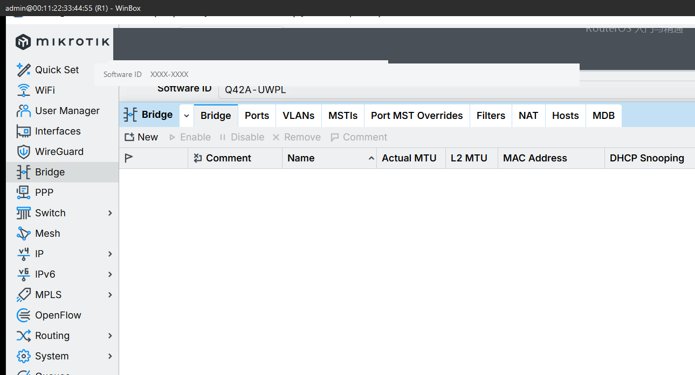

# IPsec站点到站点

> 适用版本：RouterOS 7.x  
> 管理工具：WinBox  
> 官方依据：[IPsec](https://help.mikrotik.com/docs/spaces/ROS/pages/69730508/IPsec)

## 目的

两边 Peer、Identity、Policy 镜像填写。

## 网络

- 本端 LAN `192.168.88.0/24` 对端 `192.168.90.0/24`

## 第1步：加 Policy

WinBox：`IP → IPsec → Policies → +`

Src `192.168.88.0/24` Dst `192.168.90.0/24` Tunnel。



```routeros
/ip/ipsec/policy/print
```

## 检查

WinBox：`IP → IPsec → Policies`

```routeros
/ip/ipsec/policy/print
```

## 常见问题

PSK 不要写进教程仓库。

