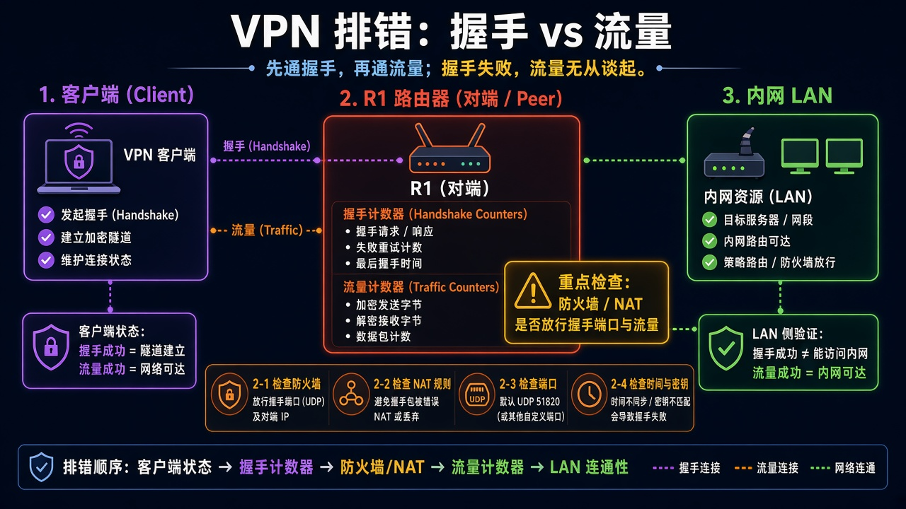

# 第 40 章：查清回家 VPN 为什么连不上

> 适用版本：RouterOS 7.x

## 目的

先看接口与握手。

## 网络

- 示例 LAN：`192.168.88.0/24`，网关 `192.168.88.1`，接口 `bridge`（改成你的口）
- WAN 示例：`pppoe-out1` 或 `ether1`
- 密码示例：`********`（填你自己的管理员密码）
- 身份示例：`R1`

## 网络拓扑及原理图

握手、防火墙端口、路由/AllowedIPs，缺一不可。



<p align="center">图(1) VPN排错</p>

## 第1步：看 WireGuard

WinBox：`WireGuard`

动作：接口是否 Running，端口是否监听。


<p align="center">图(2) 看WireGuard</p>


```routeros
/interface/wireguard/print
```

## 第2步：看 Peer 握手

WinBox：`WireGuard → Peers`

动作：Last Handshake 是否更新。


<p align="center">图(3) 看Peer握手</p>


```routeros
/interface/wireguard/peers/print
```

## 检查

WinBox：握手时间在刷新或隧道能 ping

```routeros
/interface/wireguard/peers/print
/ping 10.10.10.2 count=2
```
