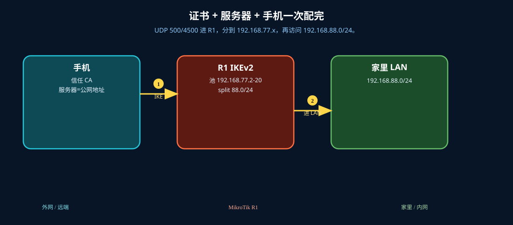
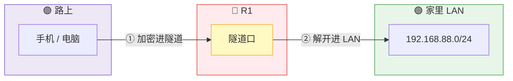
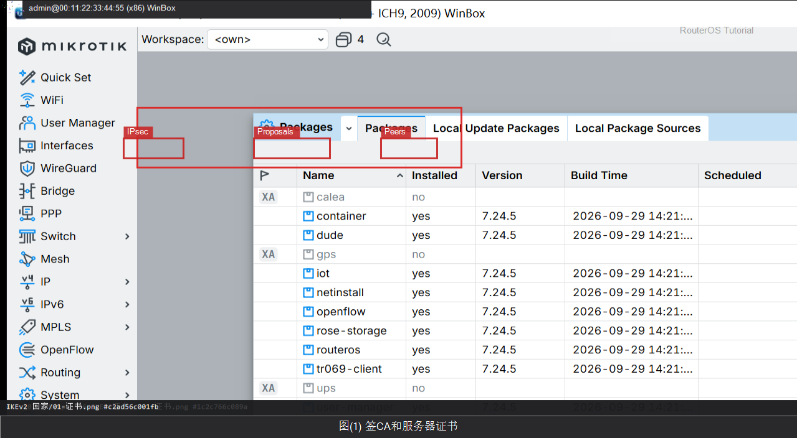
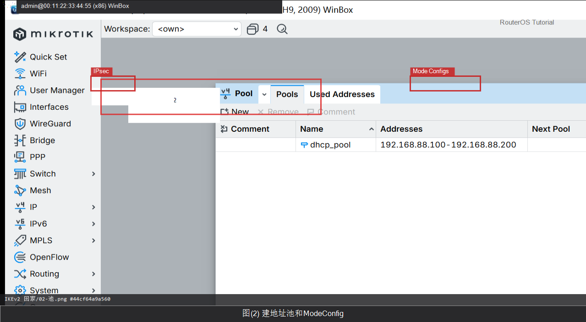
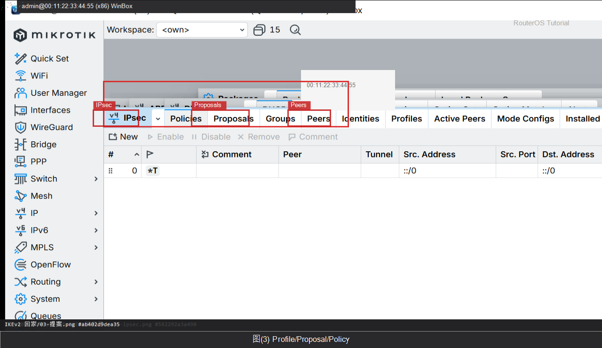
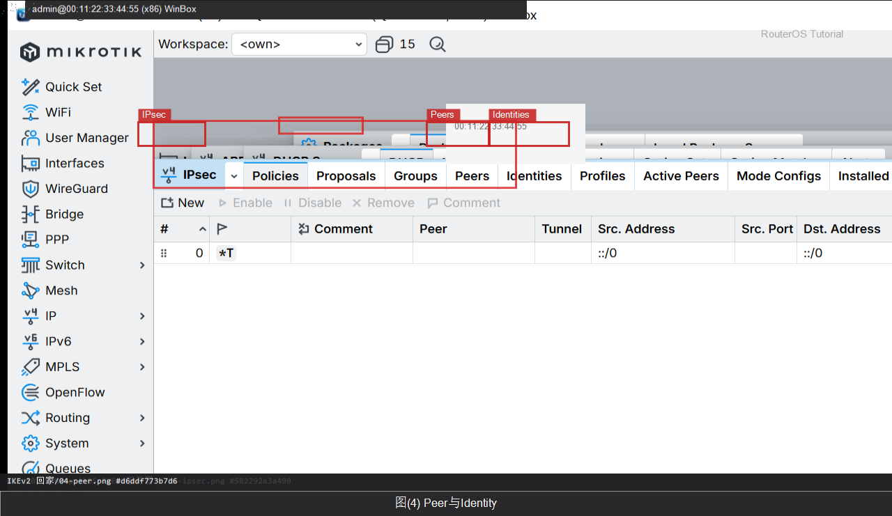
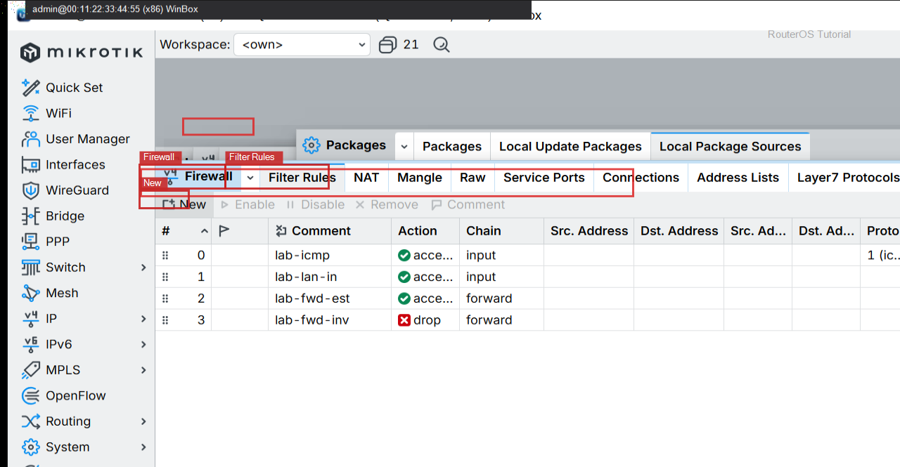
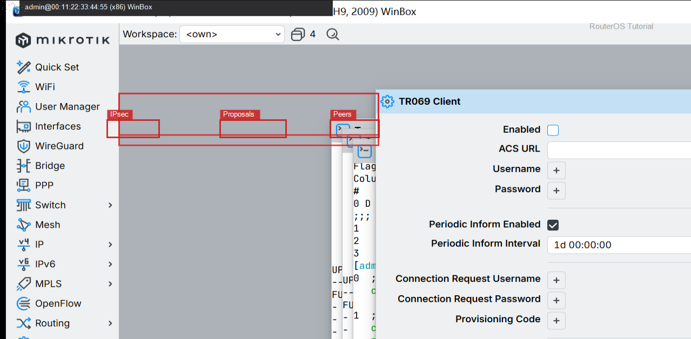

# IKEv2 回家

> 适用版本：RouterOS 7.x

## 目的

配好路由器当 IKEv2 服务器，手机/Windows 用证书连回家。

## 网络

- LAN：`192.168.88.0/24`，网关 `192.168.88.1`，接口 `bridge`（改成你的口）
- WAN：`pppoe-out1` 或 `ether1`
- 公网示例用 TEST-NET：`203.0.113.10`；密码只写 `********`
- 身份示例：`R1`
- 客户端地址池：`192.168.77.2-192.168.77.20`
- 证书 Common Name / SAN 填你的公网 IP 或域名（示例 `203.0.113.10`）

## 先看懂

UDP 500/4500 进 R1，分到 192.168.77.x，再访问 192.168.88.0/24。



<p align="center">图(1) IKEv2回家</p>



## 第1步：签 CA 和服务器证书

WinBox：`System → Certificates → + / Sign`

动作：先建 CA（key-usage 含 key-cert-sign），Sign。再建 server：common-name 与 SAN=你的公网 IP 或 DNS，key-usage 含 tls-server，用 CA 签发。



<p align="center">图(2) 签CA和服务器证书</p>


```routeros
/certificate/add name=ca common-name=home-ca key-usage=key-cert-sign,crl-sign
/certificate/sign ca
/certificate/add name=server1 common-name=203.0.113.10 subject-alt-name=IP:203.0.113.10 key-usage=tls-server
/certificate/sign server1 ca=ca
```

## 第2步：建地址池和 Mode Config

WinBox：`IP → Pool / IP → IPsec → Mode Configs`

动作：Pool=ike2-pool。Mode Config：Name=ike2-conf，Address Pool=ike2-pool，Split Include=192.168.88.0/24。



<p align="center">图(3) 建地址池和ModeConfig</p>


```routeros
/ip/pool/add name=ike2-pool ranges=192.168.77.2-192.168.77.20
/ip/ipsec/mode-config/add name=ike2-conf address-pool=ike2-pool address-prefix-length=32 split-include=192.168.88.0/24
```

## 第3步：Profile / Proposal / Policy

WinBox：`IP → IPsec`

动作：Profile 名 ike2；Proposal 名 ike2，pfs-group=none。Policy Group=ike2-policies；模板：src=0.0.0.0/0 dst=192.168.77.0/24 template=yes。



<p align="center">图(4) Profile/Proposal/Policy</p>


```routeros
/ip/ipsec/profile/add name=ike2
/ip/ipsec/proposal/add name=ike2 pfs-group=none
/ip/ipsec/policy/group/add name=ike2-policies
/ip/ipsec/policy/add src-address=0.0.0.0/0 dst-address=192.168.77.0/24 group=ike2-policies proposal=ike2 template=yes
```

## 第4步：Peer 与 Identity

WinBox：`IP → IPsec → Peers / Identities`

动作：Peer：exchange-mode=ike2，passive=yes，profile=ike2。Identity：digital-signature，certificate=server1，generate-policy=port-strict，mode-config=ike2-conf。



<p align="center">图(5) Peer与Identity</p>


```routeros
/ip/ipsec/peer/add name=ike2 exchange-mode=ike2 profile=ike2 passive=yes
/ip/ipsec/identity/add peer=ike2 auth-method=digital-signature certificate=server1 generate-policy=port-strict mode-config=ike2-conf policy-template-group=ike2-policies
```

## 第5步：防火墙放行 IKE

WinBox：`IP → Firewall → Filter Rules`

动作：input 放行 UDP 500、4500 和 ipsec-esp。



<p align="center">图(6) 防火墙放行IKE</p>


```routeros
/ip/firewall/filter/add chain=input protocol=udp dst-port=500,4500 action=accept comment=lab-ike
/ip/firewall/filter/add chain=input protocol=ipsec-esp action=accept comment=lab-esp
```

## 第6步：导出证书给手机/Windows

WinBox：`System → Certificates → Export`

动作：导出 CA（无私钥）给客户端信任；Windows 还需导入。私钥口令只在本机填 ********，不要写进文档。



<p align="center">图(7) 导出证书给手机/Windows</p>


```routeros
/certificate/export-certificate ca
/file/print where name~"cert_export"
```

## 检查

WinBox：IPsec Active Peers 有条目；手机能 ping 192.168.88.1

```routeros
/ip/ipsec/active-peers/print
/ip/ipsec/installed-sa/print
```

## 常见问题

容易忽略：证书 CN/SAN 必须对得上客户端填的服务器地址。UDP 500/4500 要通。时间不准会验签失败，先配 NTP。
