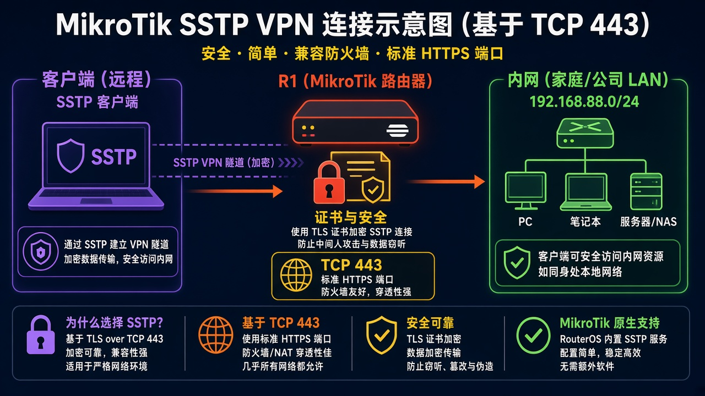
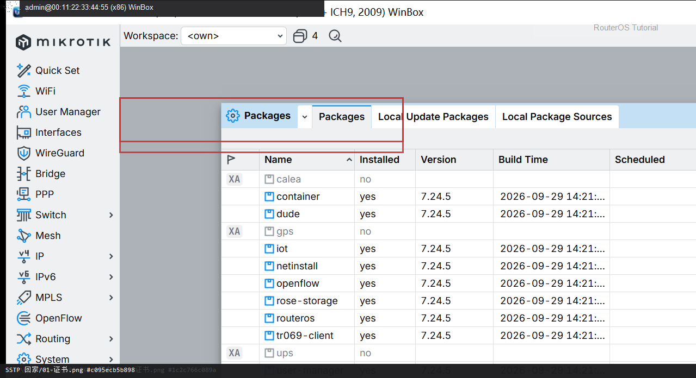
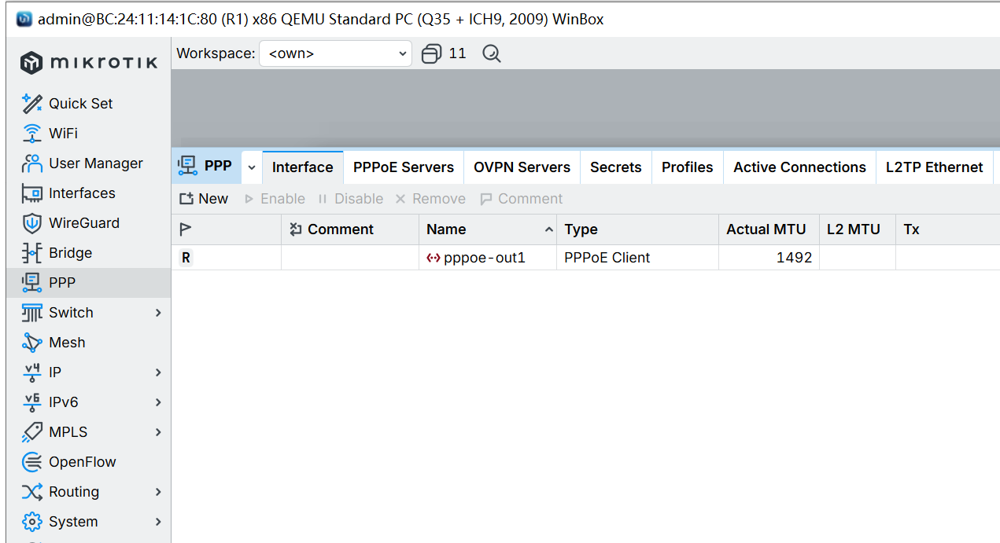

# 第 36 章：让 Windows 用 SSTP 连回家

> 适用版本：RouterOS 7.x

## 目的

路由器开 SSTP（TCP 443），Windows 用账号连回家。

## 网络

- LAN：`192.168.88.0/24`，网关 `192.168.88.1`，接口 `bridge`（改成你的口）
- WAN：`pppoe-out1` 或 `ether1`
- 公网示例用 TEST-NET：`203.0.113.10`；密码只写 `********`
- 身份示例：`R1`
- 隧道：路由器 `10.20.20.1`，客户端 `10.20.20.2`
- 默认端口 TCP 443，和 WebFig HTTPS 冲突时改 SSTP 端口或关掉 www-ssl

## 网络拓扑及原理图

Windows 走 TCP 443，像上网一样穿过多数防火墙。



<p align="center">图(1) SSTP回家</p>


<p align="center">图(2) 数据包变形</p>


``
``

## 第1步：准备服务器证书

WinBox：`System → Certificates`

动作：签 CA + server（tls-server）。Windows 要用自签时，必须把 CA 装进「受信任的根」。



<p align="center">图(3) 准备服务器证书</p>


```routeros
/certificate/add name=ca-sstp common-name=sstp-ca key-usage=key-cert-sign,crl-sign
/certificate/sign ca-sstp
/certificate/add name=sstp-server common-name=203.0.113.10 subject-alt-name=IP:203.0.113.10 key-usage=tls-server
/certificate/sign sstp-server ca=ca-sstp
```

## 第2步：建 PPP 用户

WinBox：`PPP → Secrets → +`

动作：Name=vpnuser，Password=********，Service=sstp，Local Address=10.20.20.1，Remote Address=10.20.20.2。


<p align="center">图(4) 建PPP用户</p>


```routeros
/ppp/secret/add name=vpnuser password=******** service=sstp local-address=10.20.20.1 remote-address=10.20.20.2
```

## 第3步：启用 SSTP 服务器

WinBox：`PPP → Interface → SSTP Server`

动作：Enabled=yes，Certificate=sstp-server，Authentication 建议只留 mschap2，Default Profile=default-encryption。


<p align="center">图(5) 启用SSTP服务器</p>


```routeros
/interface/sstp-server/server/set enabled=yes certificate=sstp-server authentication=mschap2 default-profile=default-encryption
```

## 第4步：防火墙放行 443

WinBox：`IP → Firewall → Filter Rules`

动作：input TCP 443 accept（若 443 已给 www-ssl，改 SSTP port）。



<p align="center">图(6) 防火墙放行443</p>


```routeros
/ip/firewall/filter/add chain=input protocol=tcp dst-port=443 action=accept comment=lab-sstp
```

## 检查

WinBox：PPP 出现 sstp 会话；客户端能 ping 10.20.20.1

```routeros
/interface/sstp-server/server/print
/ppp/active/print
```

## 常见问题

容易忽略：Windows 不信任自签 CA 会立刻断开。两台 RouterOS 之间可以无证书，但 Windows 不行。
