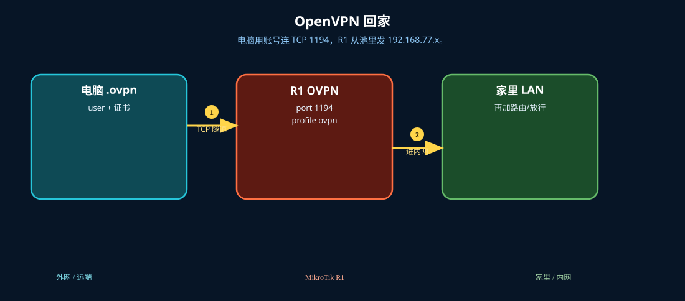
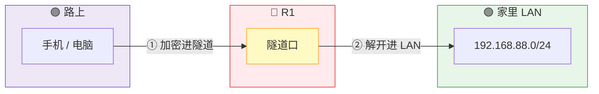

# OpenVPN 回家

> 适用版本：RouterOS 7.x

## 目的

路由器开 OVPN 服务器，电脑用账号（和证书）连回家。

## 网络

- LAN：`192.168.88.0/24`，网关 `192.168.88.1`，接口 `bridge`（改成你的口）
- WAN：`pppoe-out1` 或 `ether1`
- 公网示例用 TEST-NET：`203.0.113.10`；密码只写 `********`
- 身份示例：`R1`
- 池：`192.168.77.2-192.168.77.20`，本端 `192.168.77.1`
- 默认 TCP 1194（也可改 UDP）

## 先看懂

电脑用账号连 TCP 1194，R1 从池里发 192.168.77.x。





## 第1步：签服务器证书

WinBox：`System → Certificates`

动作：CA + server（tls-server）。最简只需服务器证书。


```routeros
/certificate/add name=ca-ovpn common-name=ovpn-ca key-usage=key-cert-sign,crl-sign
/certificate/sign ca-ovpn
/certificate/add name=ovpn-server common-name=203.0.113.10 key-usage=tls-server
/certificate/sign ovpn-server ca=ca-ovpn
```

## 第2步：地址池和 PPP Profile

WinBox：`IP → Pool / PPP → Profiles`

动作：Pool=ovpn-pool。Profile 名 ovpn：Local Address=192.168.77.1，Remote Address=ovpn-pool。


```routeros
/ip/pool/add name=ovpn-pool ranges=192.168.77.2-192.168.77.20
/ppp/profile/add name=ovpn local-address=192.168.77.1 remote-address=ovpn-pool
```

## 第3步：PPP 账号

WinBox：`PPP → Secrets → +`

动作：Name=ovpnuser，Password=********，Service=ovpn，Profile=ovpn。


```routeros
/ppp/secret/add name=ovpnuser password=******** service=ovpn profile=ovpn
```

## 第4步：启用 OVPN 服务器

WinBox：`PPP / Interfaces → OVPN Server`

动作：v7 用 /interface/ovpn-server/server add：certificate=ovpn-server，disabled=no，port=1194。


```routeros
/interface/ovpn-server/server/add name=ovpn-home certificate=ovpn-server port=1194 protocol=tcp disabled=no default-profile=ovpn
```

## 第5步：防火墙放行 1194

WinBox：`IP → Firewall → Filter Rules`

动作：input TCP（或 UDP）1194 accept。


```routeros
/ip/firewall/filter/add chain=input protocol=tcp dst-port=1194 action=accept comment=lab-ovpn
```

## 检查

WinBox：有 ovpn 动态接口或 PPP Active；客户端能 ping 192.168.77.1

```routeros
/interface/ovpn-server/server/print
/ppp/active/print
```

## 常见问题

容易忽略：客户端 .ovpn 里的 cipher 要和服务器一致。时间必须准。导出客户端配置需要 require-client-certificate。
