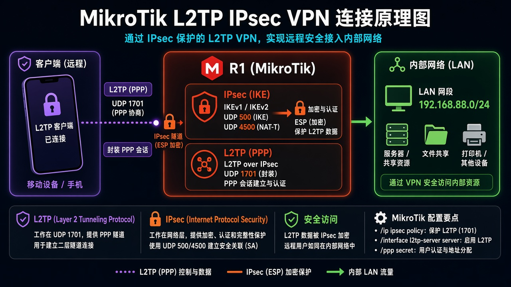
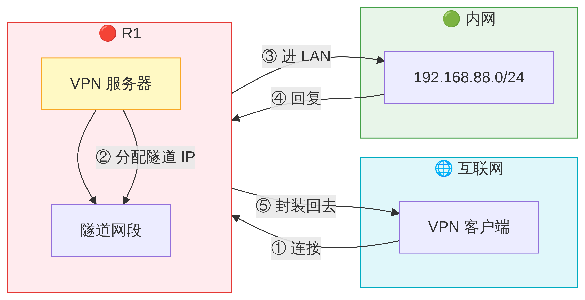

# 第 38 章：让电脑用 L2TP／IPsec 连回家

> 适用版本：RouterOS 7.x

## 目的

Windows/手机用 L2TP/IPsec 连回家（use-ipsec=require）。

## 网络

- LAN：`192.168.88.0/24`，网关 `192.168.88.1`，接口 `bridge`（改成你的口）
- WAN：`pppoe-out1` 或 `ether1`
- 公网示例用 TEST-NET：`203.0.113.10`；密码只写 `********`
- 身份示例：`R1`
- 隧道：本端 `10.30.30.1`，对端 `10.30.30.2`
- IPsec 预共享密钥只在路由器和手机上填，文档写 ********

## 网络拓扑及原理图

L2TP 自己不加密；Windows 默认就是 L2TP/IPsec。



<p align="center">图(1) L2TP回家</p>



<p align="center">图(2) 数据包变形</p>


``
``

## 第1步：PPP 账号

WinBox：`PPP → Secrets → +`

动作：Name=l2tpuser，Password=********，Service=l2tp，Local=10.30.30.1，Remote=10.30.30.2。


<p align="center">图(3) PPP账号</p>


```routeros
/ppp/secret/add name=l2tpuser password=******** service=l2tp local-address=10.30.30.1 remote-address=10.30.30.2 profile=default-encryption
```

## 第2步：启用 L2TP 服务器并强制 IPsec

WinBox：`PPP → Interface → L2TP Server`

动作：Enabled=yes，Use IPsec=require，IPsec Secret=********。官方：L2TP 本身不加密，要用 IPsec。


<p align="center">图(4) 启用L2TP服务器并强制IPsec</p>


```routeros
/interface/l2tp-server/server/set enabled=yes use-ipsec=require ipsec-secret=******** default-profile=default-encryption
```

## 第3步：防火墙

WinBox：`IP → Firewall → Filter Rules`

动作：放行 UDP 500、4500、1701 和 ipsec-esp。


<p align="center">图(5) 防火墙</p>


```routeros
/ip/firewall/filter/add chain=input protocol=udp dst-port=500,4500,1701 action=accept comment=lab-l2tp
/ip/firewall/filter/add chain=input protocol=ipsec-esp action=accept comment=lab-esp
```

## 检查

WinBox：PPP Active 有 l2tp；IPsec 有 SA

```routeros
/interface/l2tp-server/server/print
/ppp/active/print
/ip/ipsec/active-peers/print
```
