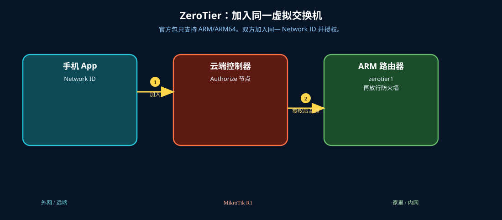

# ZeroTier

> 适用版本：RouterOS 7.x

## 目的

ARM/ARM64 设备加入 ZeroTier 网络，从手机直达家里 LAN。

## 网络

- LAN：`192.168.88.0/24`，网关 `192.168.88.1`，接口 `bridge`（改成你的口）
- WAN：`pppoe-out1` 或 `ether1`
- 公网示例用 TEST-NET：`203.0.113.10`；密码只写 `********`
- 身份示例：`R1`
- Network ID 示例：`1d71939404912b40`（换成你在 my.zerotier.com 创建的）
- **官方：zerotier 包只支持 ARM/ARM64。x86 / 本课实验机 901 装不了，请用 ARM 硬件跟做。**

## 先看懂

官方包只支持 ARM/ARM64。双方加入同一 Network ID 并授权。



<p align="center">图(0) ZeroTier</p>

## 第1步：确认架构并安装包

WinBox：`System → Resources / Packages`

动作：Architecture 必须是 arm 或 arm64。Extra packages 里上传 zerotier-*.npk 后重启。x86 到此停止。


<p align="center">图(1) 确认架构并安装包</p>


```routeros
/system/resource/print
/system/package/print
```

## 第2步：启用实例并加入网络

WinBox：`ZeroTier`

动作：/zerotier/enable zt1。Interface → +，Network=你的 16 位 Network ID，Instance=zt1。


<p align="center">图(2) 启用实例并加入网络</p>


```routeros
/zerotier/enable zt1
/zerotier/interface/add network=1d71939404912b40 instance=zt1
/zerotier/interface/print
```

## 第3步：控制台授权节点

WinBox：`浏览器 my.zerotier.com 或 RouterOS Controller`

动作：Private 网络必须在网页勾选 Authorize。Status 应变为 OK。


<p align="center">图(3) 控制台授权节点</p>


```routeros
/zerotier/interface/print
/ip/address/print where interface~"zero"
```

## 第4步：防火墙放行 ZeroTier 口

WinBox：`IP → Firewall → Filter Rules`

动作：input/forward 对 zerotier1 accept（按官方示例放在前面）。


<p align="center">图(4) 防火墙放行ZeroTier口</p>


```routeros
/ip/firewall/filter/add chain=input in-interface=zerotier1 action=accept comment=lab-zt-in place-before=0
/ip/firewall/filter/add chain=forward in-interface=zerotier1 action=accept comment=lab-zt-fwd place-before=0
```

## 检查

WinBox：zerotier1 为 R，有动态地址；能 ping 对端 ZeroTier IP

```routeros
/zerotier/interface/print
/ip/address/print where interface~"zero"
```

## 常见问题

容易忽略：device-mode 可能关掉 ZeroTier，要本机按键才能改。UDP 9993 出站不要拦。LAN 路由在 ZeroTier 控制台里推送。
