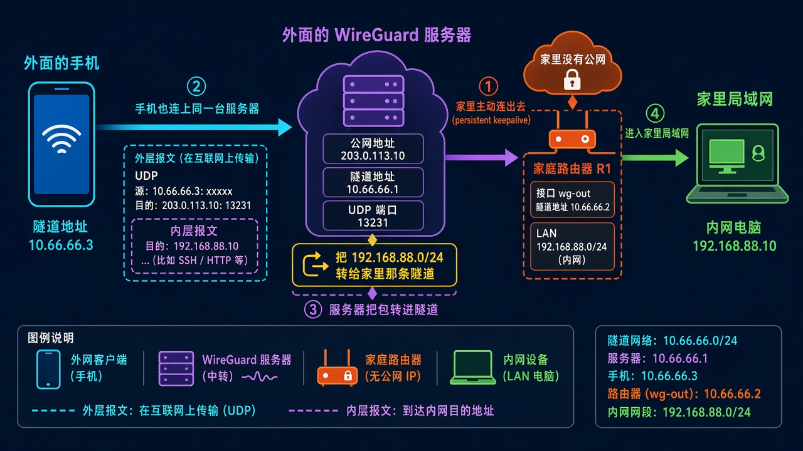
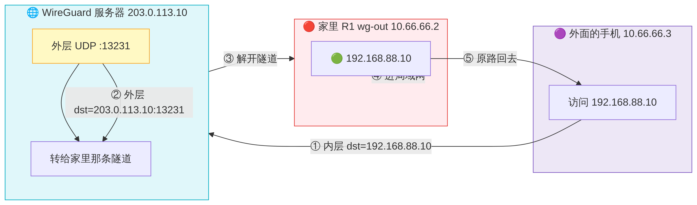
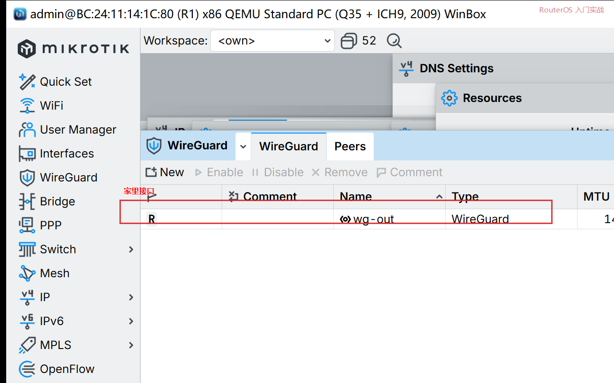
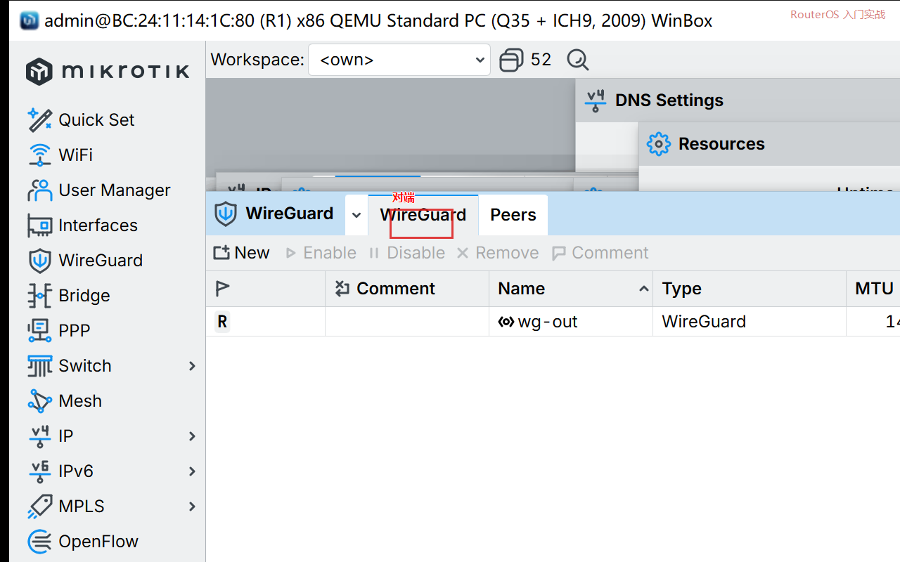
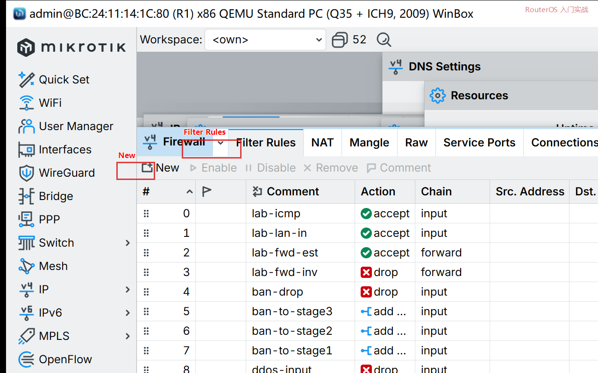

# 第 55 章：让家里主动连出 WireGuard，人在外面进局域网

> 适用版本：RouterOS 7.x

## 目的

家里没有公网 IP 时，路由器主动连到外面那台有公网的 WireGuard，人在外面进家里电脑。

和第 32 章不一样：第 32 章是家里监听端口等人来连；这一章是家里当客户端连出去。

## 网络

- 家里 LAN：`192.168.88.0/24`，R1=`192.168.88.1`
- 外面服务器公网示例：`203.0.113.10`，UDP `13231`
- 隧道：`10.66.66.0/24`。服务器 `10.66.66.1`，家里 `10.66.66.2`，手机 `10.66.66.3`
- 家里接口名：`wg-out`
- 公钥示例：`BASE64PUBLICKEY=======`（填双方真实公钥，勿写私钥）
- 身份示例：`R1`

Demo 许可的 x86 往往只允许 1 个 WireGuard 接口。已经有一个的话，改名字继续用，不要再新建。

## 网络拓扑及原理图

家里先握手出去。手机也连同一台服务器。服务器把去 `192.168.88.0/24` 的包转进家里这条隧道。



<p align="center">图(1) 家里主动连出</p>



<p align="center">图(2) 数据包变形</p>

## 第1步：家里这条隧道

WinBox：`WireGuard`

动作：没有接口就 `+`，Name=`wg-out`。已经有一个时，把 Name 改成 `wg-out`。Listen Port 填一个家里自己的口，例如 `13232`（对端连你时才用；本课是你连出去）。记下公钥，私钥不要外传。



<p align="center">图(3) 家里接口</p>

```routeros
/interface/wireguard/add name=wg-out listen-port=13232
/interface/wireguard/print
```

## 第2步：给隧道加地址

WinBox：`IP → Addresses → +`

动作：Address=`10.66.66.2/24`，Interface=`wg-out`。

```routeros
/ip/address/add address=10.66.66.2/24 interface=wg-out comment=wg-out
```

## 第3步：对端填外面那台服务器

WinBox：`WireGuard → Peers → +`

动作：Interface=`wg-out`，Public Key=服务器公钥，Endpoint=`203.0.113.10`，Port=`13231`，Allowed Address=`10.66.66.0/24,192.168.88.0/24` 按你服务器路由来填，至少包含 `10.66.66.0/24`。Persistent Keepalive=`25s`。家里在 NAT 后面，这条必须开。



<p align="center">图(4) 对端</p>

```routeros
/interface/wireguard/peers/add interface=wg-out public-key="BASE64PUBLICKEY=======" endpoint-address=203.0.113.10 endpoint-port=13231 allowed-address=10.66.66.0/24 persistent-keepalive=25s comment=vps
```

## 第4步：放行隧道进出家里

WinBox：`IP → Firewall → Filter Rules`

动作：forward 里放行 `wg-out` ↔ `bridge`；input 里放行 `in-interface=wg-out`。



<p align="center">图(5) 放行隧道</p>

```routeros
/ip/firewall/filter/add chain=forward in-interface=wg-out out-interface=bridge action=accept comment=wg-to-lan
/ip/firewall/filter/add chain=forward in-interface=bridge out-interface=wg-out action=accept comment=lan-to-wg
/ip/firewall/filter/add chain=input in-interface=wg-out action=accept comment=wg-input
```

## 第5步：外面那台服务器

在 VPS 的 WireGuard 里加家里这个 Peer：Public Key=家里公钥，Allowed Address=`10.66.66.2/32,192.168.88.0/24`。要让手机进 LAN，服务器还要把 `192.168.88.0/24` 指到家里这条隧道。

## 第6步：手机

和连普通 WireGuard 一样。Endpoint 填 `203.0.113.10:13231`，隧道地址 `10.66.66.3/24`，Allowed IPs 带上 `10.66.66.0/24` 和 `192.168.88.0/24`。

Windows：装官方 WireGuard，新建隧道，字段同上。

## 检查

WinBox：`WireGuard → Peers` 看 Last Handshake。对端是示例地址时，握手会一直空，这是正常的。换成你自己的服务器后，应出现秒数，并能 ping `192.168.88.1`。

```routeros
/interface/wireguard/peers/print
/ping 10.66.66.1
```

## 常见问题

Keepalive 关掉，家里在运营商 NAT 后面时，对端回不了包。Allowed Address 漏了 `192.168.88.0/24`，手机只能 ping 隧道，进不了家里电脑。
