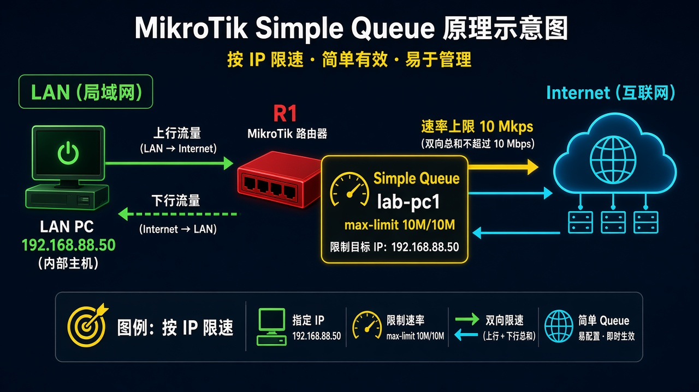
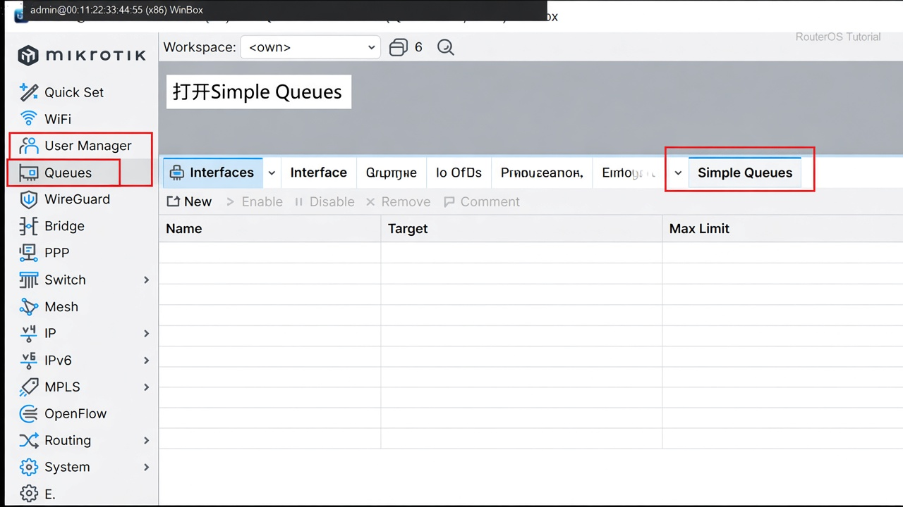
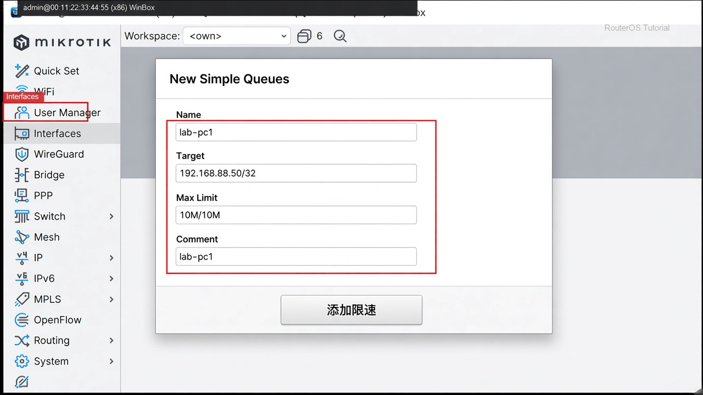

# 第 27 课：让某一台电脑限速

> 适用版本：RouterOS 7.x

## 目的

给指定 IP 封顶上下行。

## 网络

- 示例 LAN：`192.168.88.0/24`，网关 `192.168.88.1`，接口 `bridge`（改成你的口）
- WAN 示例：`pppoe-out1` 或 `ether1`
- 密码示例：`********`（填你自己的管理员密码）
- 身份示例：`R1`

被限主机示例：`192.168.88.50`，上限 `10M/10M`（下载/上传，单位 bit）。

## 网络拓扑及原理图

这台电脑进出都经过 R1 的一条 Simple Queue。



<p align="center">图(1) Simple Queue</p>

## 第1步：打开队列

WinBox：`Queues → Simple Queues`

动作：确认在 Simple Queues，不是 Queue Tree。



<p align="center">图(2) 打开SimpleQueues</p>

```routeros
/queue/simple/print
```

## 第2步：添加限速

WinBox：`Queues → Simple Queues → +`

动作：Name=`lab-pc1`，Target=`192.168.88.50/32`，Max Limit=`10M/10M`，Comment=`lab-pc1`。



<p align="center">图(3) 添加限速</p>

```routeros
/queue/simple/add name=lab-pc1 target=192.168.88.50/32 max-limit=10M/10M comment=lab-pc1
```

## 检查

WinBox：那台电脑测速顶在约 10 Mbps，队列计数在涨

```routeros
/queue/simple/print stats where comment=lab-pc1
```

## 常见问题

限了没效果：Target 必须是这台机当前地址。
