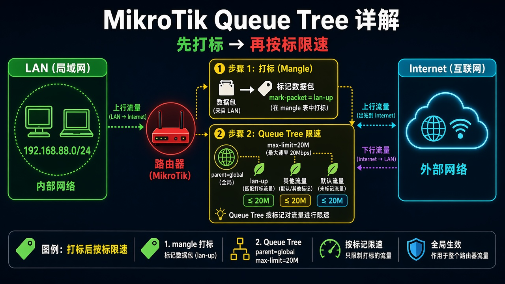
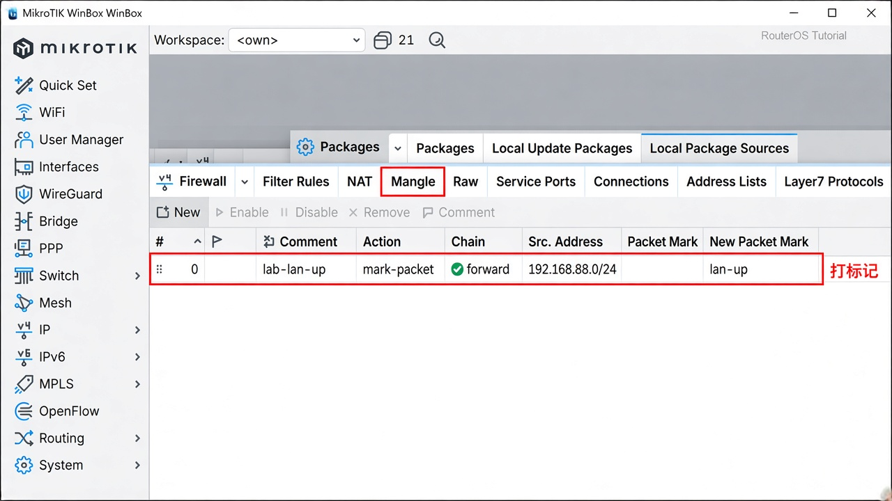
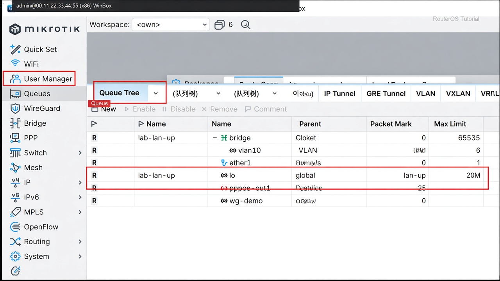

# 第 28 章：让整个网段限速

> 适用版本：RouterOS 7.x

## 目的

先打标记，再按标记给整网封顶。

## 网络

- 示例 LAN：`192.168.88.0/24`，网关 `192.168.88.1`，接口 `bridge`（改成你的口）
- WAN 示例：`pppoe-out1` 或 `ether1`
- 密码示例：`********`（填你自己的管理员密码）
- 身份示例：`R1`

内网上行封顶示例：`20M`。

## 网络拓扑及原理图

mangle 给包打标，Queue Tree 按标限速。



<p align="center">图(1) Queue Tree</p>

## 第1步：打数据包标记

WinBox：`IP → Firewall → Mangle → +`

动作：Chain=`forward`，Src. Address=`192.168.88.0/24`，Action=`mark packet`，New Packet Mark=`lan-up`，Passthrough 去掉，Comment=`lab-lan-up`。



<p align="center">图(2) 打标记</p>

```routeros
/ip/firewall/mangle/add chain=forward src-address=192.168.88.0/24 action=mark-packet new-packet-mark=lan-up passthrough=no comment=lab-lan-up
```

## 第2步：加 Queue Tree

WinBox：`Queues → Queue Tree → +`

动作：Name=`lab-lan-up`，Parent=`global`，Packet Mark=`lan-up`，Max Limit=`20M`。



<p align="center">图(3) QueueTree</p>

```routeros
/queue/tree/add name=lab-lan-up parent=global packet-mark=lan-up max-limit=20M
```

## 检查

WinBox：整网测速顶在约 20 Mbps，tree 计数在涨

```routeros
/queue/tree/print stats
/ip/firewall/mangle/print where comment=lab-lan-up
```

## 常见问题

有 FastTrack 时，被 fasttrack 的包可能不进 mangle/queue。要限速的流先关掉 FastTrack 再试。
