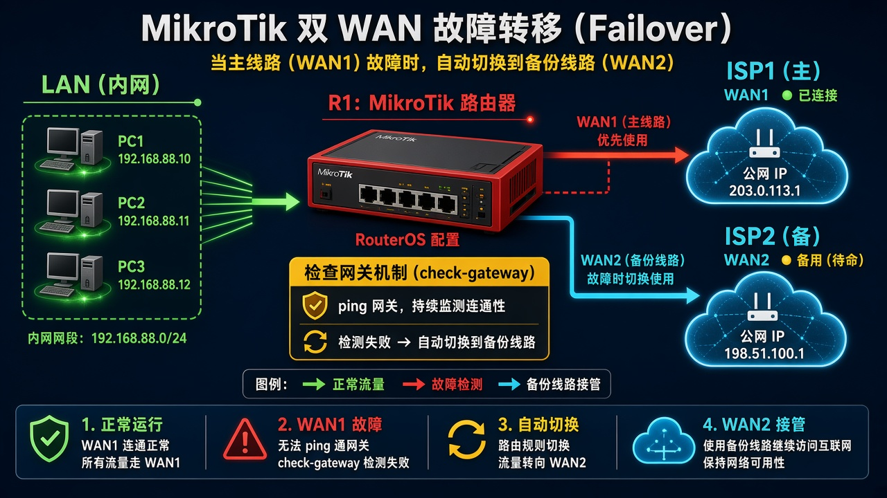
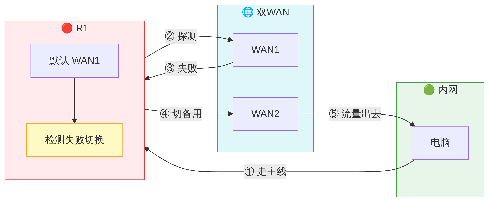

# 第 17 课：让两条宽带互相备份上网

> 适用版本：RouterOS 7.x

## 目的

两条上行，用 distance 区分主备。

## 网络

- 示例 LAN：`192.168.88.0/24`，网关 `192.168.88.1`，接口 `bridge`（改成你的口）
- WAN 示例：`pppoe-out1` 或 `ether1`
- 密码示例：`********`（填你自己的管理员密码）
- 身份示例：`R1`

## 网络拓扑及原理图

主线路优先，断了走备用；距离/探测决定谁在用。



<p align="center">图(1) 双WAN</p>



<p align="center">图(2) 数据包变形</p>


## 第1步：看默认路由

WinBox：`IP → Routes`

动作：主线 distance 更小，带 A。


<p align="center">图(3) 看默认路由</p>


```routeros
/ip/route/print where dst-address=0.0.0.0/0
```

## 第2步：备线 distance

WinBox：`IP → Routes → +`

动作：备线 distance=2；可加 check-gateway=ping。


<p align="center">图(4) 备线distance</p>


```routeros
/ip/route/add dst-address=0.0.0.0/0 gateway=ether2 distance=2 check-gateway=ping
```

## 检查

WinBox：主线 Active

```routeros
/ip/route/print where dst-address=0.0.0.0/0
```
