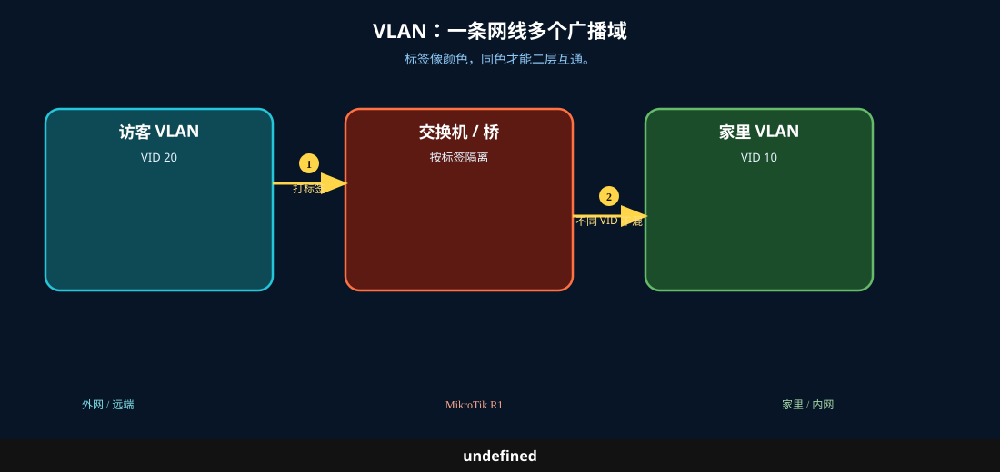
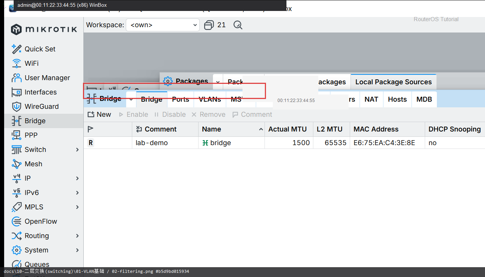

# VLAN 基础

> 适用版本：RouterOS 7.x

## 目的

先认 VLAN ID 与 Bridge VLAN Filtering。

## 网络

- 示例 LAN：`192.168.88.0/24`，网关 `192.168.88.1`，接口 `bridge`（改成你的口）
- WAN 示例：`pppoe-out1` 或 `ether1`
- 密码示例：`********`（填你自己的管理员密码）
- 身份示例：`R1`

## 先看懂

标签像颜色，同色才能二层互通。



<p align="center">图(1) VLAN基础</p>

## 第1步：打开 Bridge

WinBox：`Bridge`

动作：确认有 bridge。


<p align="center">图(2) 打开Bridge</p>


```routeros
/interface/bridge/print
```

## 第2步：看 VLAN Filtering

WinBox：`Bridge → 双击 bridge`

动作：vlan-filtering 按你环境开启（改前备份）。



<p align="center">图(3) 看VLANFiltering</p>


```routeros
/interface/bridge/print detail
```

## 检查

WinBox：知道 VLAN ID 与 filtering 开关

```routeros
/interface/bridge/print
/interface/bridge/vlan/print
```
