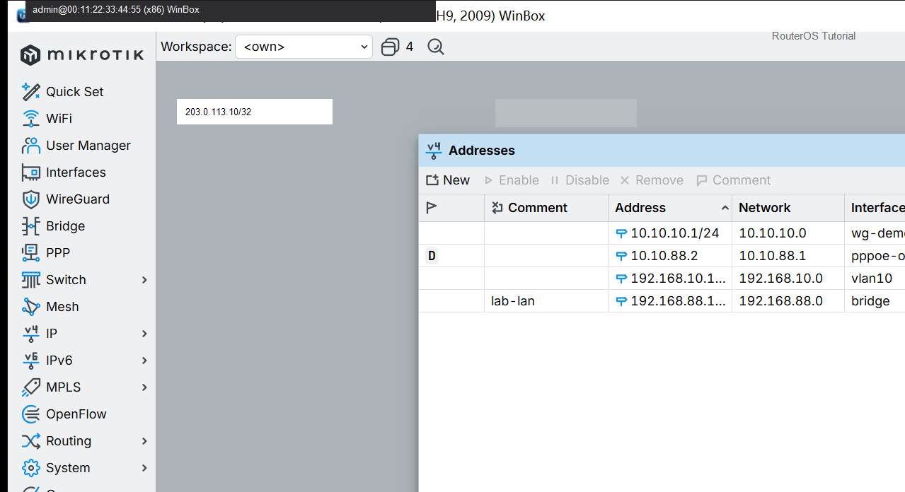
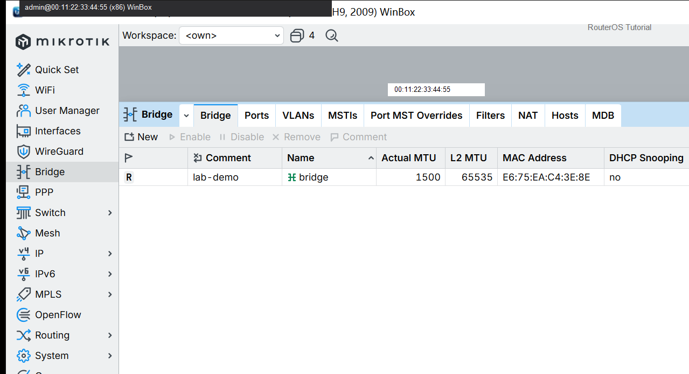

# 创建 VLAN

> 适用版本：RouterOS 7.x  
> 管理工具：WinBox  
> 官方依据：[VLAN](https://help.mikrotik.com/docs/spaces/ROS/pages/18964487/Bridging+and+Switching)

## 目的

在 bridge 上建 vlan10。

## 网络

- 示例 LAN：`192.168.88.0/24`，网关 `192.168.88.1`，接口 `bridge`
- WAN 示例：`pppoe-out1` 或 `ether1`
- 密码示例：`********`（填你自己的）
- 身份示例：`R1`

## 第1步：添加 VLAN 接口

WinBox：`Interfaces → VLAN → +`

动作：Name=vlan10，VLAN ID=10，Interface=bridge。901 已实配。



```routeros
/interface/vlan/add name=vlan10 vlan-id=10 interface=bridge
```

## 第2步：（可选）开 filtering

WinBox：`Bridge → 双击 bridge`

动作：VLAN Filtering 勾选前先配好 tagged/untagged，防锁死。



```routeros
/interface/bridge/set bridge vlan-filtering=yes
```

## 检查

WinBox：Interfaces 有 vlan10

```routeros
/interface/vlan/print
```

## 常见问题

远程改 filtering 要小心。
