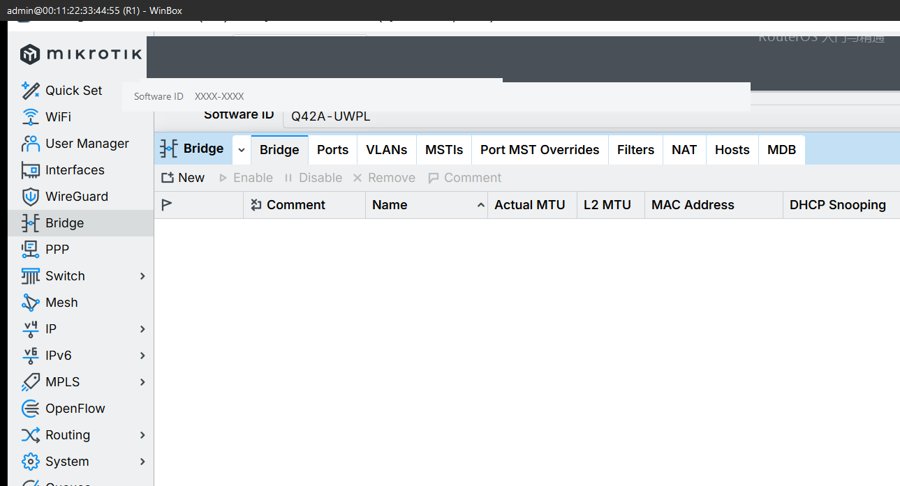

# 创建VLAN

> 适用版本：RouterOS 7.x  
> 管理工具：WinBox  
> 官方依据：[Bridging and Switching](https://help.mikrotik.com/docs/spaces/ROS/pages/328081/Bridging+and+Switching)

## 目的

在桥上启用 VLAN 10。

## 网络

- 示例 LAN：`192.168.88.1/24`，接口 `bridge`（改成你的口）
- WAN 示例口：`ether1`
- 密码示例：`********`（填你自己的）

## 第1步：开 filtering

WinBox：`Bridge → Bridge 双击桥`

勾选 VLAN Filtering（先配完端口再勾，避免把自己锁外面）。


```routeros
/interface/bridge/set [find name=bridge] vlan-filtering=yes
```

## 第2步：加 VLAN

WinBox：`Bridge → VLAN → +`

Bridge `bridge`，VLAN IDs `10`，Tagged 填 trunk 口。



```routeros
/interface/bridge/vlan/add bridge=bridge vlan-ids=10 tagged=ether3
```

## 检查

WinBox：`Bridge → VLAN`

```routeros
/interface/bridge/vlan/print
```

## 常见问题

锁在外面就用 MAC 连进去改。

