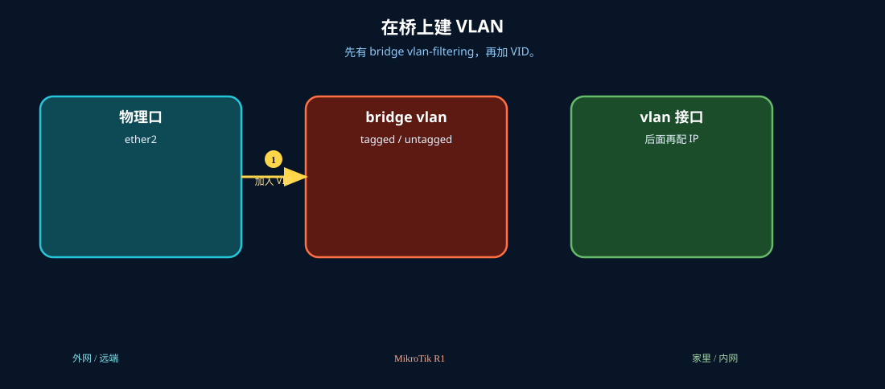

# 创建 VLAN

> 适用版本：RouterOS 7.x

## 目的

在 Bridge 上建 VLAN。

## 网络

- 示例 LAN：`192.168.88.0/24`，网关 `192.168.88.1`，接口 `bridge`（改成你的口）
- WAN 示例：`pppoe-out1` 或 `ether1`
- 密码示例：`********`（填你自己的管理员密码）
- 身份示例：`R1`

## 先看懂

先有 bridge vlan-filtering，再加 VID。



<p align="center">图(0) 创建VLAN</p>

## 第1步：打开 Bridge VLANs

WinBox：`Bridge → VLANs`

动作：准备添加条目。


<p align="center">图(1) 打开BridgeVLANs</p>


```routeros
/interface/bridge/vlan/print
```

## 第2步：添加 VLAN

WinBox：`Bridge → VLANs → +`

动作：vlan-ids=10，tagged/untagged 按拓扑填。


<p align="center">图(2) 添加VLAN</p>


```routeros
/interface/bridge/vlan/add bridge=bridge vlan-ids=10 tagged=bridge
```

## 检查

WinBox：VLAN 表有 10

```routeros
/interface/bridge/vlan/print
```
