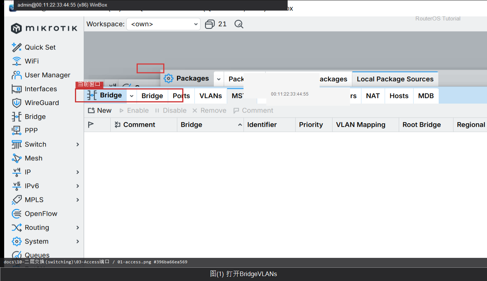
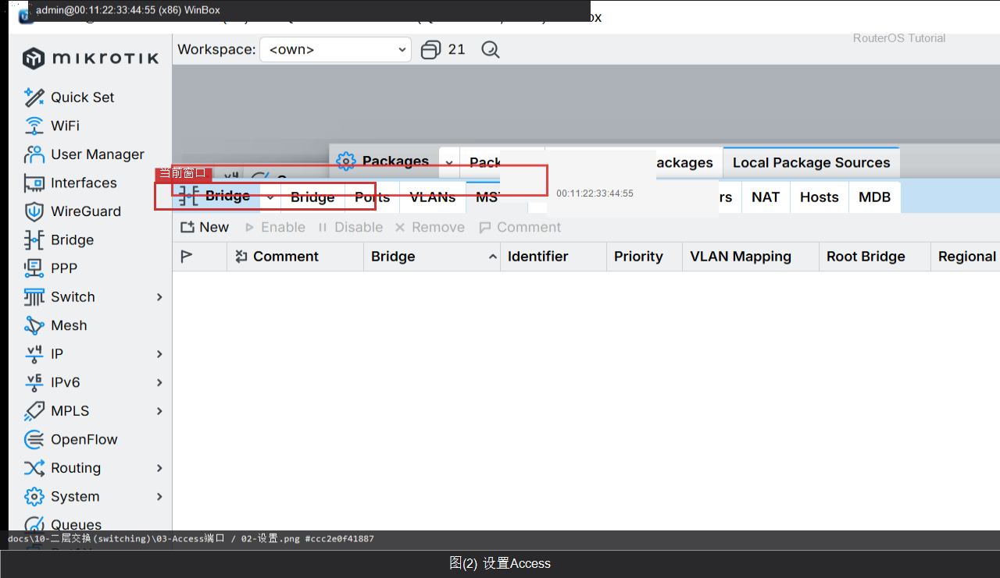

# Access 端口

> 适用版本：RouterOS 7.x


## 目的

终端口只属一个 VLAN。

## 网络

- 示例 LAN：`192.168.88.0/24`，网关 `192.168.88.1`，接口 `bridge`（改成你的口）
- WAN 示例：`pppoe-out1` 或 `ether1`
- 密码示例：`********`（填你自己的管理员密码）
- 身份示例：`R1`

## 第1步：打开 Bridge VLANs

WinBox：`Bridge → VLANs`

动作：准备添加 vlan-ids 与 untagged 端口。



```routeros
/interface/bridge/vlan/print
```

## 第2步：设置 Access

WinBox：`Bridge → VLANs → +`

动作：vlan-ids=10，untagged=ether3（示例）。



```routeros
/interface/bridge/vlan/add bridge=bridge vlan-ids=10 untagged=ether3
```

## 检查

WinBox：VLAN 表有对应条目

```routeros
/interface/bridge/vlan/print
```
