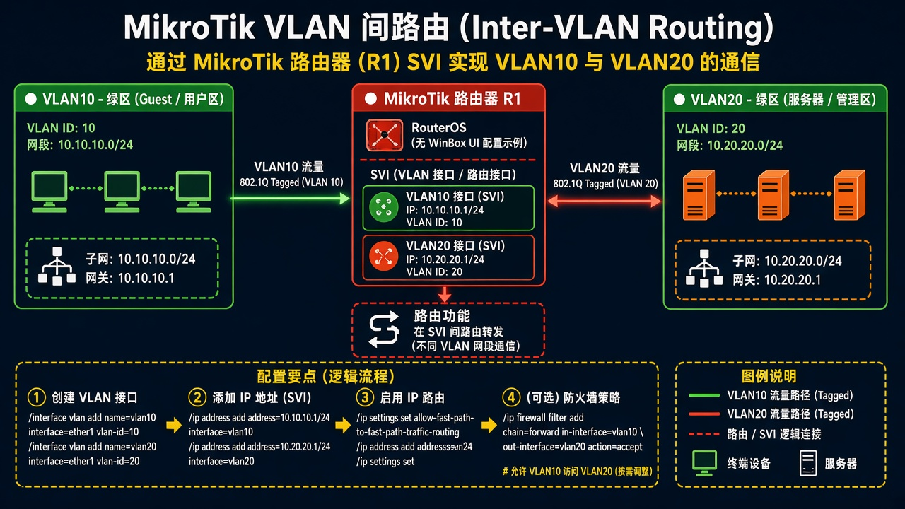
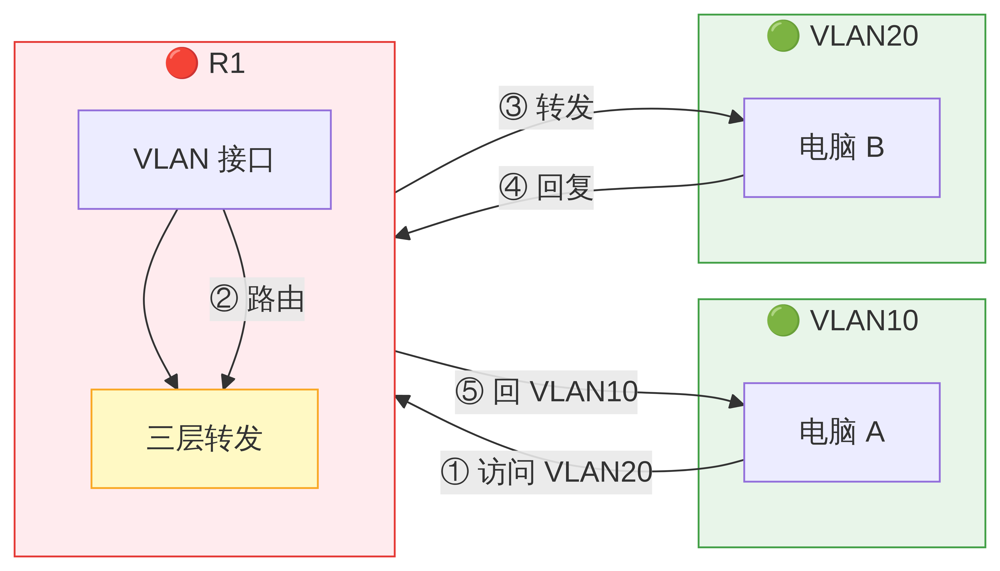

# 第 21 章：让家里不同 VLAN 能互相访问

> 适用版本：RouterOS 7.x

## 目的

家里划出 VLAN10，电脑口 Access、上联 Trunk，R1 上有地址，两网段能互通（或按防火墙挡住）。

## 网络

- VLAN10：`192.168.10.0/24`，网关 `192.168.10.1`，接口 `vlan10`
- Access 示例口：`ether3`；Trunk 示例口：`ether2`
- 密码示例：`********`（填你自己的管理员密码）
- 身份示例：`R1`

## 网络拓扑及原理图

每个 VLAN 一个地址，电脑打普通网线进 Access；交换机之间走 Trunk。



<p align="center">图(1) 家里 VLAN</p>



<p align="center">图(2) 数据包变形</p>

## 第1步：打开桥 VLAN 过滤

WinBox：`Bridge` 双击 `bridge`

动作：先把 VLAN 表和口配完，最后再勾 VLAN Filtering，避免把自己锁死。

```routeros
/interface/bridge/set bridge vlan-filtering=yes
```

## 第2步：Access 口

WinBox：`Bridge → Ports` 双击 `ether3`；`Bridge → VLANs → +`

动作：PVID=`10`。VLAN 表：vlan-ids=`10`，untagged=`ether3`，tagged=`bridge`。

```routeros
/interface/bridge/port/set [find interface=ether3] pvid=10
/interface/bridge/vlan/add bridge=bridge vlan-ids=10 tagged=bridge untagged=ether3
```

## 第3步：Trunk 口

WinBox：`Bridge → VLANs`

动作：vlan-ids=`10,20`，tagged 加上 `ether2` 和 `bridge`。

```routeros
/interface/bridge/vlan/add bridge=bridge vlan-ids=10,20 tagged=bridge,ether2
```

## 第4步：VLAN 接口

WinBox：`Interfaces → VLAN → +`

动作：Name=`vlan10`，VLAN ID=`10`，Interface=`bridge`。

```routeros
/interface/vlan/add name=vlan10 vlan-id=10 interface=bridge
```

## 第5步：加地址

WinBox：`IP → Addresses → +`

动作：Address=`192.168.10.1/24`，Interface=`vlan10`。


<p align="center">图(3) 加地址</p>

```routeros
/ip/address/add address=192.168.10.1/24 interface=vlan10
```

## 检查

WinBox：vlan10 有地址；Access 电脑能 ping `192.168.10.1`

```routeros
/interface/bridge/vlan/print
/ip/address/print where interface=vlan10
```
