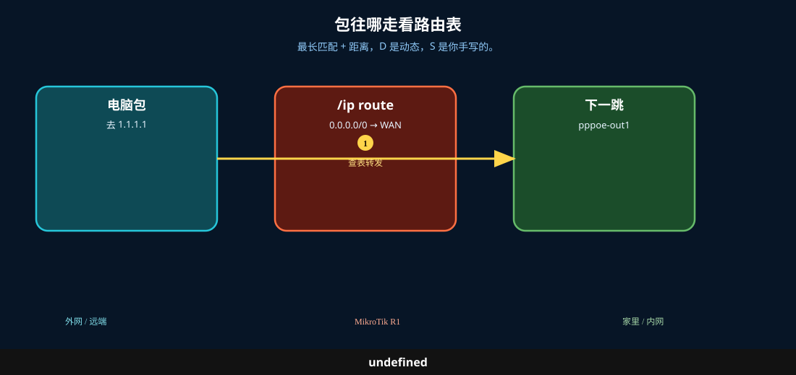
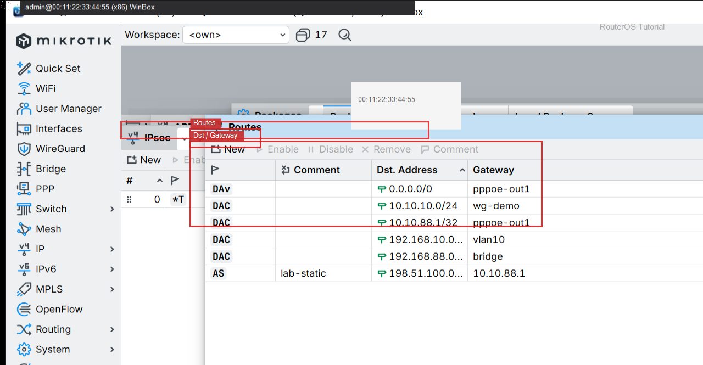

# 查看路由表

> 适用版本：RouterOS 7.x

## 目的

先会看路由再改路由。

## 网络

- 示例 LAN：`192.168.88.0/24`，网关 `192.168.88.1`，接口 `bridge`（改成你的口）
- WAN 示例：`pppoe-out1` 或 `ether1`
- 密码示例：`********`（填你自己的管理员密码）
- 身份示例：`R1`

## 先看懂

最长匹配 + 距离，D 是动态，S 是你手写的。



<p align="center">图(0) 路由表</p>

## 第1步：打开 Routes

WinBox：`IP → Routes`

动作：看 Dst. Address、Gateway、Distance、标志 A/D/C/S。


<p align="center">图(1) 打开Routes</p>


```routeros
/ip/route/print
```

## 第2步：找默认路由

WinBox：`IP → Routes`

动作：找到 0.0.0.0/0 且带 A 的条目。



<p align="center">图(2) 找默认路由</p>


```routeros
/ip/route/print where dst-address=0.0.0.0/0
```

## 检查

WinBox：有 Active 的 0.0.0.0/0

```routeros
/ip/route/print where dst-address=0.0.0.0/0
```
