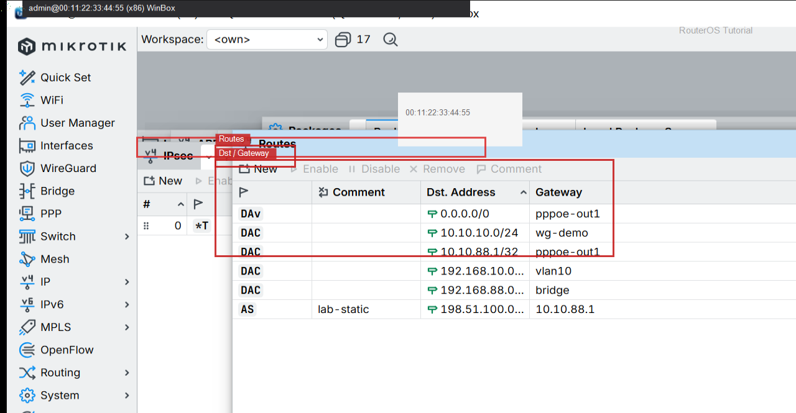

# 默认路由

> 适用版本：RouterOS 7.x  
> 管理工具：WinBox  
> 官方依据：[Routes](https://help.mikrotik.com/docs/spaces/ROS/pages/59968792/Routes)

## 目的

所有未知目的走默认出口。

## 网络

- 示例 LAN：`192.168.88.0/24`，网关 `192.168.88.1`，接口 `bridge`（改成你的口）
- WAN 示例：`pppoe-out1` 或 `ether1`
- 密码示例：`********`（填你自己的管理员密码）
- 身份示例：`R1`

## 第1步：确认默认路由

WinBox：`IP → Routes`

动作：Dst=0.0.0.0/0，Gateway=WAN（如 pppoe-out1）。



```routeros
/ip/route/print where dst-address=0.0.0.0/0
```

## 检查

WinBox：有 Active 的 0.0.0.0/0

```routeros
/ip/route/print where dst-address=0.0.0.0/0
```

## 常见问题

PPPoE 常自动下发默认路由。
