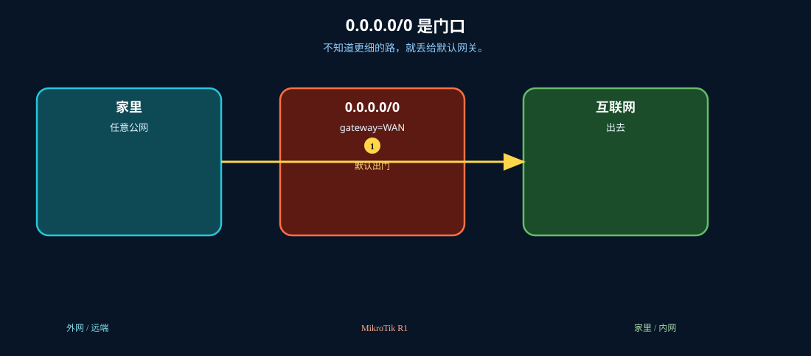
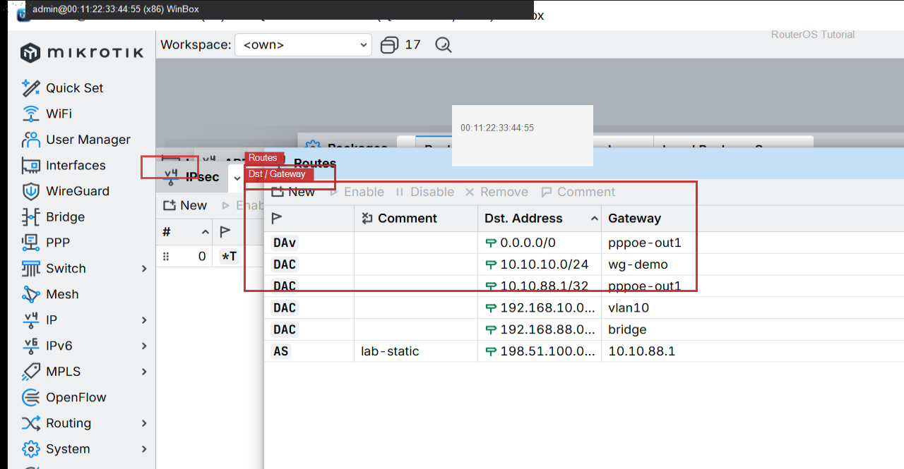

# 默认路由

> 适用版本：RouterOS 7.x

## 目的

所有未知目的走默认出口。

## 网络

- 示例 LAN：`192.168.88.0/24`，网关 `192.168.88.1`，接口 `bridge`（改成你的口）
- WAN 示例：`pppoe-out1` 或 `ether1`
- 密码示例：`********`（填你自己的管理员密码）
- 身份示例：`R1`

## 先看懂

不知道更细的路，就丢给默认网关。



<p align="center">图(0) 默认路由</p>

## 第1步：确认默认路由

WinBox：`IP → Routes`

动作：Dst=0.0.0.0/0，Gateway=WAN（如 pppoe-out1）。


<p align="center">图(1) 确认默认路由</p>


```routeros
/ip/route/print where dst-address=0.0.0.0/0
```

## 第2步：核对标志

WinBox：`IP → Routes`

动作：带 A 表示 Active；D 表示动态。



<p align="center">图(2) 核对标志</p>


```routeros
/ip/route/print detail where dst-address=0.0.0.0/0
```

## 检查

WinBox：有 Active 的 0.0.0.0/0

```routeros
/ip/route/print where dst-address=0.0.0.0/0
```
