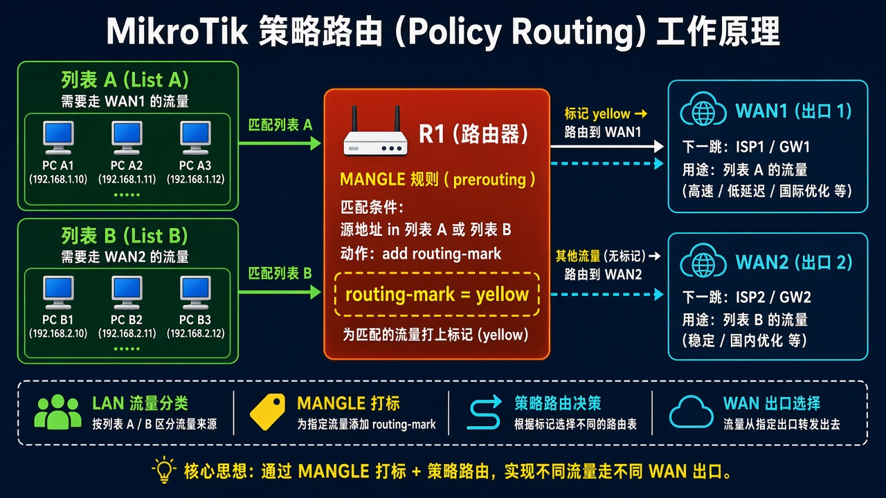
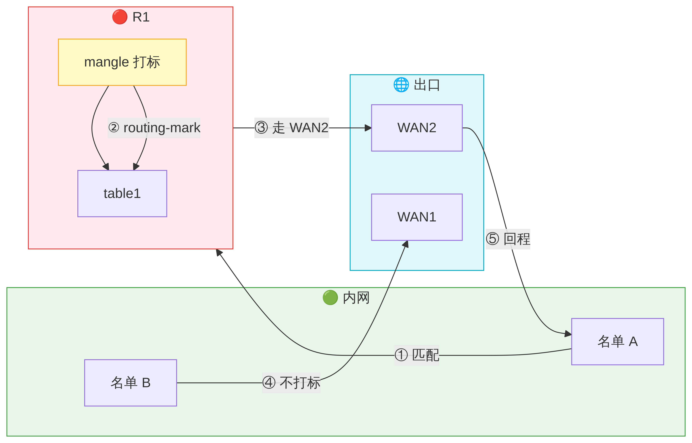

# 策略路由

> 适用版本：RouterOS 7.x

## 目的

按源地址选出口。

## 网络

- 示例 LAN：`192.168.88.0/24`，网关 `192.168.88.1`，接口 `bridge`（改成你的口）
- WAN 示例：`pppoe-out1` 或 `ether1`
- 密码示例：`********`（填你自己的管理员密码）
- 身份示例：`R1`

## 先看懂

同一目的地，访客走 WAN2，家人走 WAN1。



<p align="center">图(1) 策略路由</p>



<p align="center">图(2) 数据包变形</p>


## 第1步：建路由表

WinBox：`Routing → Tables → +`

动作：Name=via-wan2。


<p align="center">图(3) 建路由表</p>


```routeros
/routing/table/add name=via-wan2 fib
```

## 第2步：加规则

WinBox：`Routing → Rules → +`

动作：Src Address=192.168.88.0/24，Action=lookup，Table=via-wan2。


<p align="center">图(4) 加规则</p>


```routeros
/routing/rule/add src-address=192.168.88.0/24 action=lookup table=via-wan2
```

## 检查

WinBox：Rules 命中后走对应表

```routeros
/routing/rule/print
```
