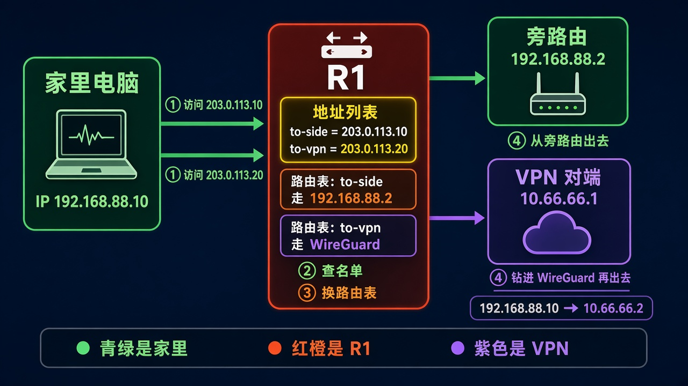
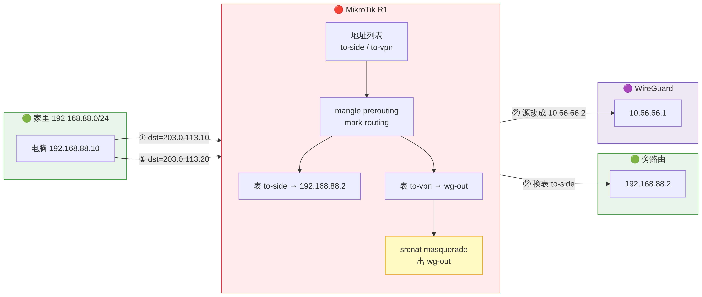
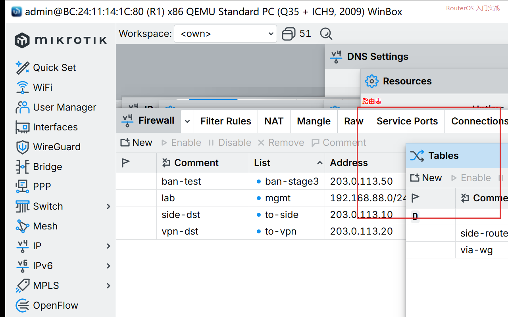
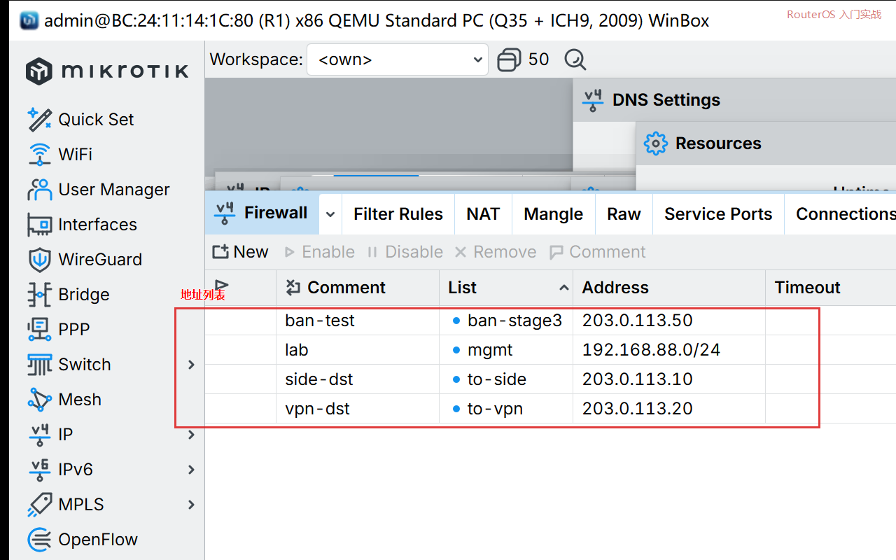
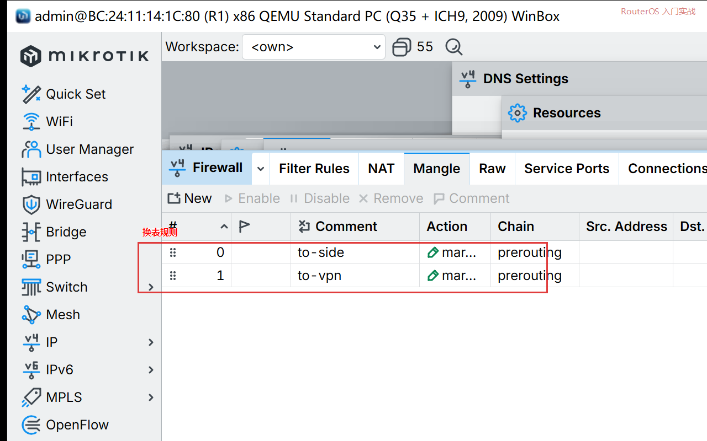

# 第 54 章：让名单里的地址改走旁路由或 VPN

> 适用版本：RouterOS 7.x

## 目的

把指定网站放进地址列表，家里电脑访问它们时改走旁路由，或钻进 WireGuard。

## 网络

- LAN：`192.168.88.0/24`，网关 `192.168.88.1`，接口 `bridge`
- 旁路由：`192.168.88.2`
- 走 VPN 的隧道：`wg-out`，本机 `10.66.66.2/24`，对端 `10.66.66.1`
- 示例：`203.0.113.10` 走旁路由；`203.0.113.20` 走 VPN
- 身份示例：`R1`

## 网络拓扑及原理图

电脑访问名单里的地址，R1 换一张路由表。走 VPN 的那条会把源地址改成隧道地址。



<p align="center">图(1) 地址列表分流</p>



<p align="center">图(2) 数据包变形</p>

## 第1步：建两张路由表

WinBox：`Routing → Tables → +`

动作：Name=`to-side`，勾 `fib`。再加一张 Name=`to-vpn`，同样勾 `fib`。



<p align="center">图(3) 路由表</p>

```routeros
/routing/table/add name=to-side fib comment=side-router
/routing/table/add name=to-vpn fib comment=via-wg
```

## 第2步：往名单里填地址

WinBox：`IP → Firewall → Address Lists → +`

动作：List=`to-side`，Address=`203.0.113.10`。再加一条 List=`to-vpn`，Address=`203.0.113.20`。



<p align="center">图(4) 地址列表</p>

```routeros
/ip/firewall/address-list/add list=to-side address=203.0.113.10 comment=side-dst
/ip/firewall/address-list/add list=to-vpn address=203.0.113.20 comment=vpn-dst
```

## 第3步：给两张表各加一条默认路由

WinBox：`IP → Routes → +`

动作：Dst. Address=`0.0.0.0/0`，Gateway=`192.168.88.2`，Routing Table=`to-side`。再加一条 Gateway=`10.66.66.1%wg-out`，Routing Table=`to-vpn`。

```routeros
/ip/route/add dst-address=0.0.0.0/0 gateway=192.168.88.2 routing-table=to-side comment=side-router
/ip/route/add dst-address=0.0.0.0/0 gateway=10.66.66.1%wg-out routing-table=to-vpn comment=via-wg-out
```

## 第4步：命中名单就换表

WinBox：`IP → Firewall → Mangle → +`

动作：Chain=`prerouting`，Dst. Address List=`to-side`，Action=`mark routing`，New Routing Mark=`to-side`，Passthrough 不要勾。再加一条 Dst. Address List=`to-vpn`，New Routing Mark=`to-vpn`。



<p align="center">图(5) mangle 打标</p>

```routeros
/ip/firewall/mangle/add chain=prerouting dst-address-list=to-side action=mark-routing new-routing-mark=to-side passthrough=no comment=to-side
/ip/firewall/mangle/add chain=prerouting dst-address-list=to-vpn action=mark-routing new-routing-mark=to-vpn passthrough=no comment=to-vpn
```

## 第5步：走 VPN 的包改源地址

WinBox：`IP → Firewall → NAT → +`

动作：Chain=`srcnat`，Out. Interface=`wg-out`，Action=`masquerade`。

```routeros
/ip/firewall/nat/add chain=srcnat out-interface=wg-out action=masquerade comment=vpn-split
```

## 检查

电脑访问 `203.0.113.10` 应出旁路由；访问 `203.0.113.20` 应进 `wg-out`。没旁路由、没对端时，路由表里这两条仍在，只是 ping 不通。

```routeros
/ip/firewall/address-list/print
/ip/route/print where routing-table=to-side
/ip/route/print where routing-table=to-vpn
```

## 常见问题

名单填域名时，客户端若自己解析成别的 IP，这条分流不会命中。要分流域名，先确认电脑拿到的就是名单里那个地址。
