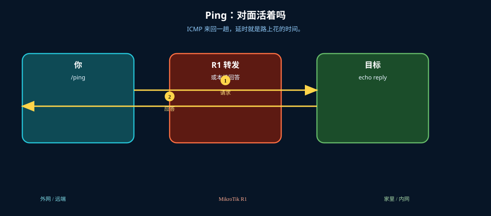
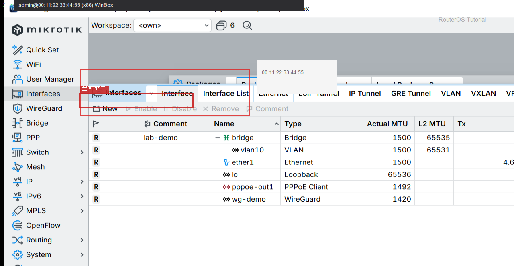
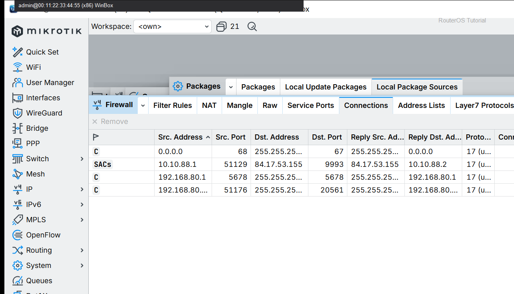

# Ping

> 适用版本：RouterOS 7.x

## 目的

测连通。

## 网络

- 示例 LAN：`192.168.88.0/24`，网关 `192.168.88.1`，接口 `bridge`（改成你的口）
- WAN 示例：`pppoe-out1` 或 `ether1`
- 密码示例：`********`（填你自己的管理员密码）
- 身份示例：`R1`

## 先看懂

ICMP 来回一趟，延时就是路上花的时间。



<p align="center">图(1) Ping</p>

## 第1步：打开 Ping

WinBox：`Tools → Ping`

动作：Address 填 1.1.1.1，Start。



<p align="center">图(2) 打开Ping</p>


```routeros
/ping 1.1.1.1 count=4
```

## 第2步：终端核对

WinBox：`New Terminal`

动作：执行同样 ping。



<p align="center">图(3) 终端核对</p>


```routeros
/ping 1.1.1.1 count=4
```

## 检查

WinBox：有回复

```routeros
/ping 1.1.1.1 count=4
```
