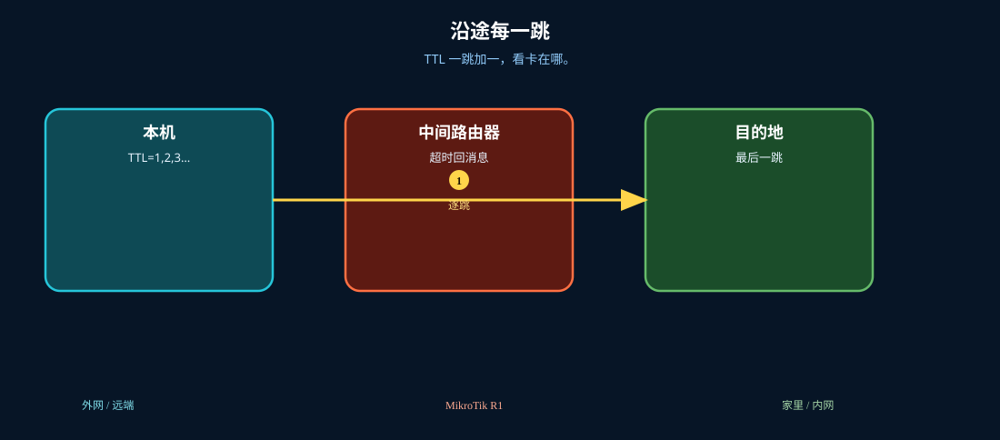
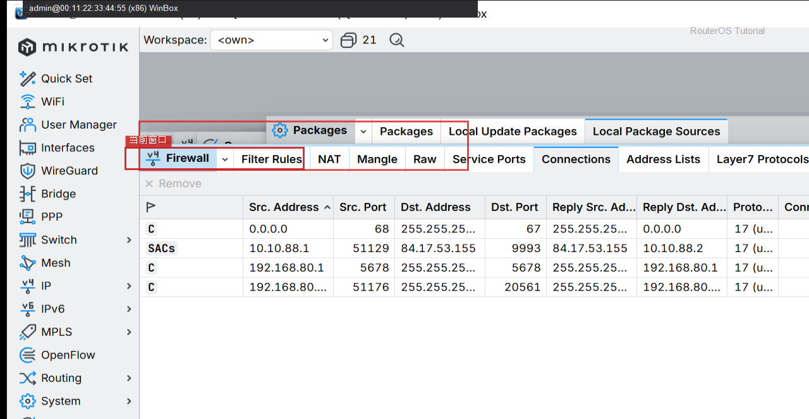

# Traceroute

> 适用版本：RouterOS 7.x

## 目的

看路径。

## 网络

- 示例 LAN：`192.168.88.0/24`，网关 `192.168.88.1`，接口 `bridge`（改成你的口）
- WAN 示例：`pppoe-out1` 或 `ether1`
- 密码示例：`********`（填你自己的管理员密码）
- 身份示例：`R1`

## 先看懂

TTL 一跳加一，看卡在哪。



<p align="center">图(0) Traceroute</p>

## 第1步：打开 Traceroute

WinBox：`Tools → Traceroute`

动作：Address 填目标后 Start。


<p align="center">图(1) 打开Traceroute</p>


```routeros
/tool/traceroute 1.1.1.1
```

## 第2步：终端核对

WinBox：`New Terminal`

动作：执行 traceroute。



<p align="center">图(2) 终端核对</p>


```routeros
/tool/traceroute 1.1.1.1
```

## 检查

WinBox：能看到跳数

```routeros
/tool/traceroute 1.1.1.1
```
