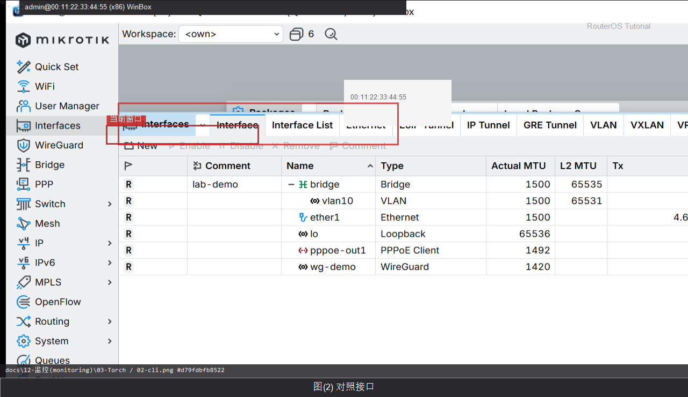

# Torch

> 适用版本：RouterOS 7.x  
> 管理工具：WinBox  
> 官方依据：[Tools](https://help.mikrotik.com/docs/spaces/ROS/pages/24952854/Tools)

## 目的

看接口实时流量。

## 网络

- 示例 LAN：`192.168.88.0/24`，网关 `192.168.88.1`，接口 `bridge`（改成你的口）
- WAN 示例：`pppoe-out1` 或 `ether1`
- 密码示例：`********`（填你自己的管理员密码）
- 身份示例：`R1`

## 第1步：打开 Torch

WinBox：`Tools → Torch`

动作：Interface 选 bridge 后 Start。


```routeros
/tool/torch interface=bridge
```

## 第2步：对照接口

WinBox：`Interfaces`

动作：流量大的口再 Torch。



```routeros
/interface/print stats
```

## 检查

WinBox：有实时会话/速率

```routeros
/tool/torch interface=bridge
```

## 常见问题

别在生产高峰长时间跑。
