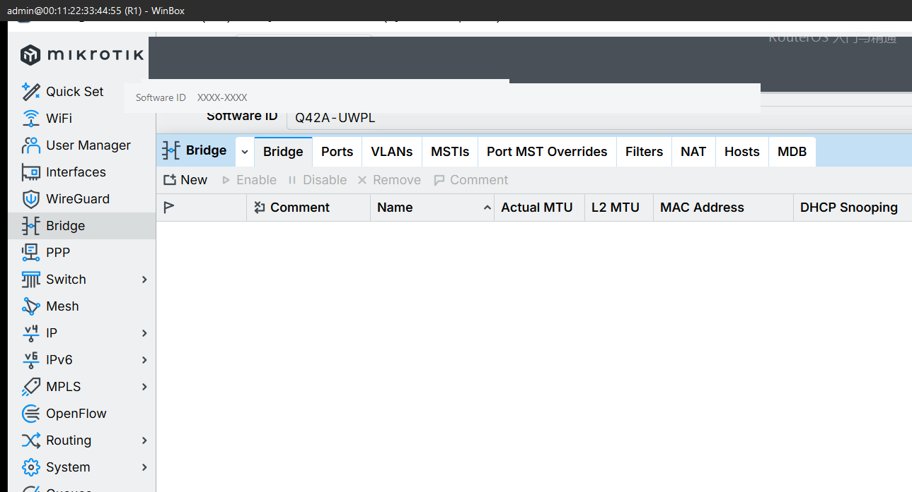

# Torch

> 适用版本：RouterOS 7.x  
> 管理工具：WinBox  
> 官方依据：[Torch](https://help.mikrotik.com/docs/spaces/ROS/pages/328189/Torch)

## 目的

看某个口此刻是谁在传。

## 网络

- 示例 LAN：`192.168.88.1/24`，接口 `bridge`（改成你的口）
- WAN 示例口：`ether1`
- 密码示例：`********`（填你自己的）

## 第1步：Torch

WinBox：`Tools → Torch`

Interface 选 `bridge` 或 `pppoe-out1`，Start。



```routeros
/tool/torch interface=bridge
```

## 检查

WinBox：`Tools → Torch`

```routeros
/tool/torch interface=bridge
```

## 常见问题

流量很大时 CPU 会升高。

