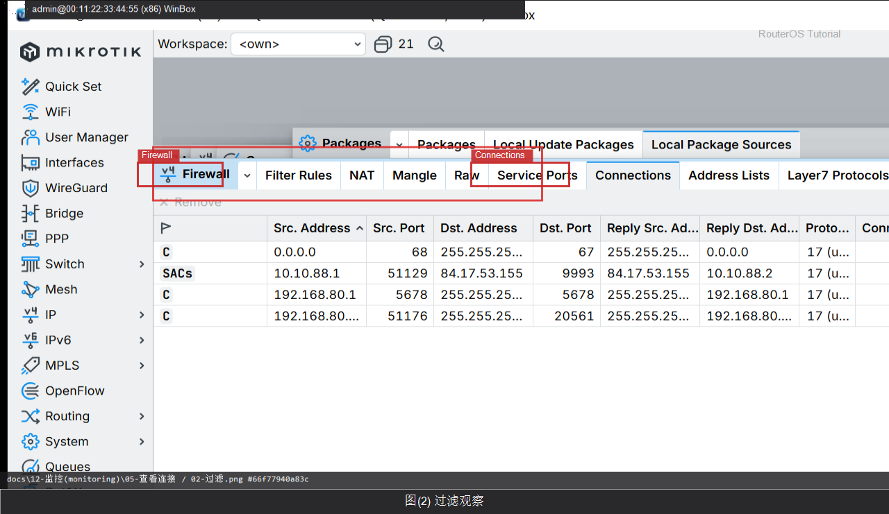

# 查看连接

> 适用版本：RouterOS 7.x

## 目的

看当前连接跟踪。

## 网络

- 示例 LAN：`192.168.88.0/24`，网关 `192.168.88.1`，接口 `bridge`（改成你的口）
- WAN 示例：`pppoe-out1` 或 `ether1`
- 密码示例：`********`（填你自己的管理员密码）
- 身份示例：`R1`

## 第1步：打开 Connections

WinBox：`IP → Firewall → Connections`

动作：看协议、源/目的、标志。


```routeros
/ip/firewall/connection/print
```

## 第2步：过滤观察

WinBox：`IP → Firewall → Connections`

动作：可按地址过滤异常连接。



```routeros
/ip/firewall/connection/print where dst-address~"1.1.1.1"
```

## 检查

WinBox：有活跃连接

```routeros
/ip/firewall/connection/print
```
