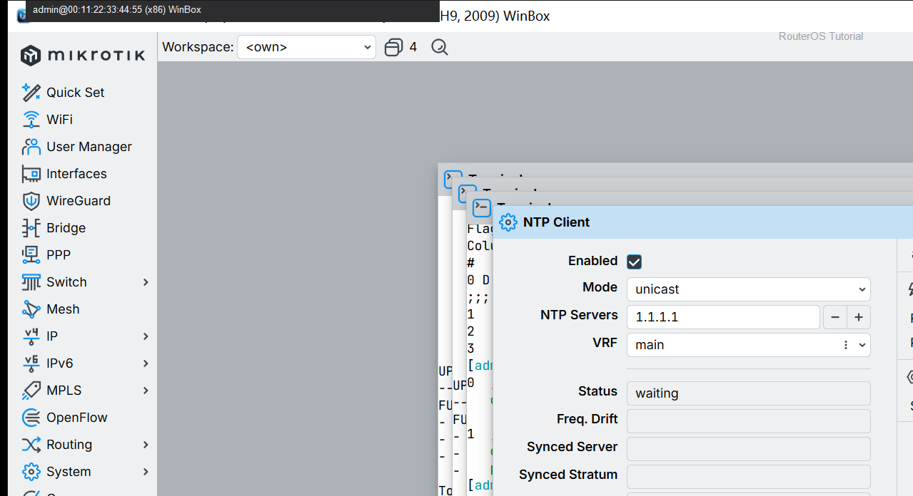

# 查看日志

> 适用版本：RouterOS 7.x  
> 管理工具：WinBox  
> 官方依据：[Logging](https://help.mikrotik.com/docs/spaces/ROS/pages/24952854/Logging)

## 目的

看系统日志。

## 网络

- 示例 LAN：`192.168.88.0/24`，网关 `192.168.88.1`，接口 `bridge`（改成你的口）
- WAN 示例：`pppoe-out1` 或 `ether1`
- 密码示例：`********`（填你自己的管理员密码）
- 身份示例：`R1`

## 第1步：打开 Log

WinBox：`Log`

动作：浏览近期事件。


```routeros
/log/print
```

## 第2步：按主题过滤

WinBox：`Log`

动作：关注 system/firewall/critical。



```routeros
/log/print where topics~"system"
```

## 检查

WinBox：日志可读

```routeros
/log/print
```

## 常见问题

日志过多先调 Topics。
