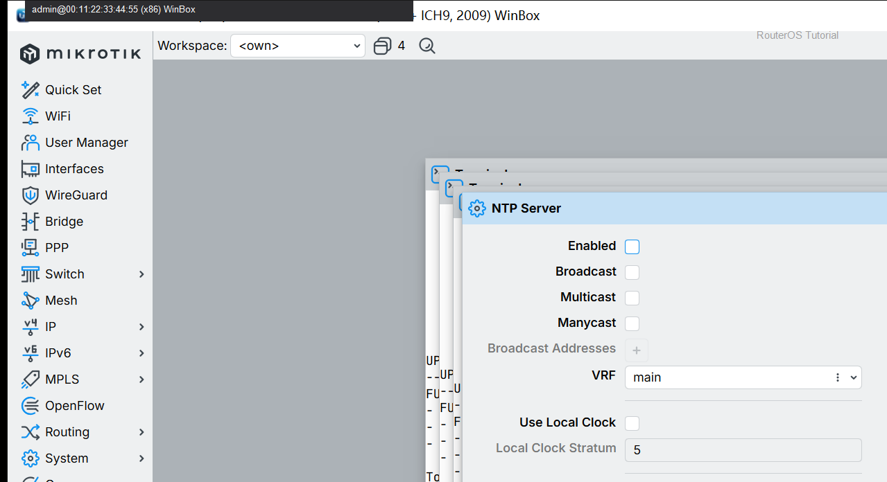
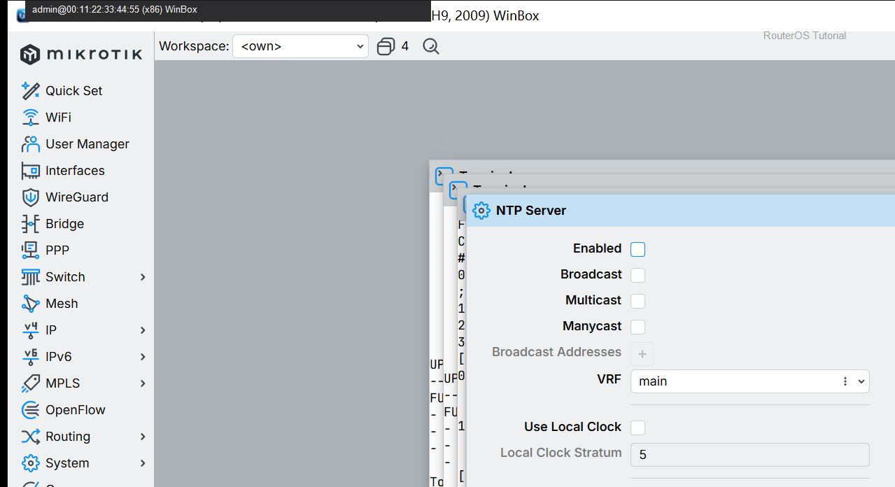

# NTP 时间

> 适用版本：RouterOS 7.x  
> 管理工具：WinBox  
> 官方依据：[Clock](https://help.mikrotik.com/docs/spaces/ROS/pages/24805287/Clock)

## 目的

时间不准证书/日志会乱。

## 网络

- 示例 LAN：`192.168.88.0/24`，网关 `192.168.88.1`，接口 `bridge`（改成你的口）
- WAN 示例：`pppoe-out1` 或 `ether1`
- 密码示例：`********`（填你自己的管理员密码）
- 身份示例：`R1`

## 第1步：打开 Clock

WinBox：`System → Clock`

动作：看当前时间与时区。



```routeros
/system/clock/print
```

## 第2步：开 NTP client

WinBox：`System → NTP Client`

动作：Servers 填 pool.ntp.org（或运营商 NTP）。



```routeros
/system/ntp/client/set enabled=yes servers=pool.ntp.org
```

## 检查

WinBox：时间接近正确

```routeros
/system/clock/print
/system/ntp/client/print
```

## 常见问题

时区选对。
