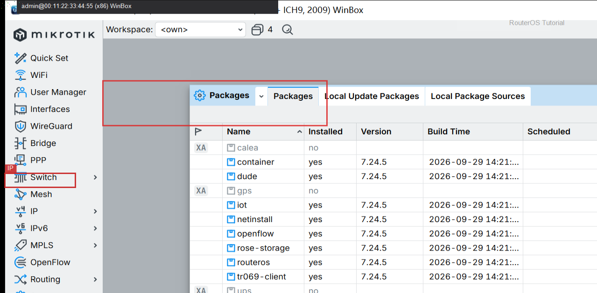
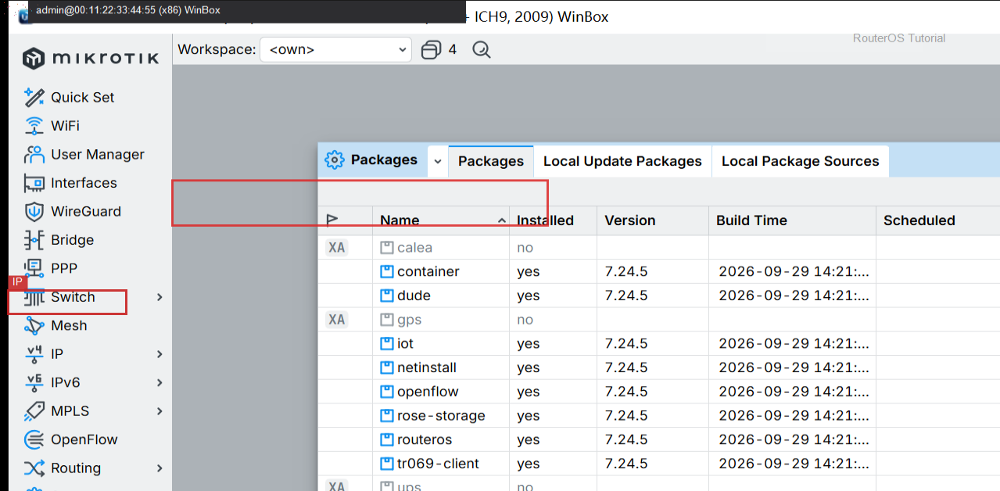

# WinBox 访问

> 适用版本：RouterOS 7.x

## 目的

限制 WinBox 服务。

## 网络

- 示例 LAN：`192.168.88.0/24`，网关 `192.168.88.1`，接口 `bridge`（改成你的口）
- WAN 示例：`pppoe-out1` 或 `ether1`
- 密码示例：`********`（填你自己的管理员密码）
- 身份示例：`R1`

## 第1步：打开 Services

WinBox：`IP → Services`

动作：找到 winbox。



<p align="center">图(1) 打开Services</p>


```routeros
/ip/service/print where name=winbox
```

## 第2步：限制网段

WinBox：`IP → Services → winbox`

动作：Available From 填 192.168.88.0/24（示例）。



<p align="center">图(2) 限制网段</p>


```routeros
/ip/service/set winbox address=192.168.88.0/24
```

## 检查

WinBox：仅可信网段可连

```routeros
/ip/service/print where name=winbox
```
