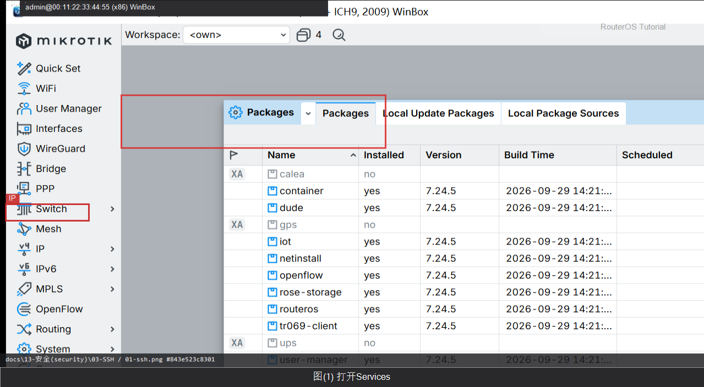
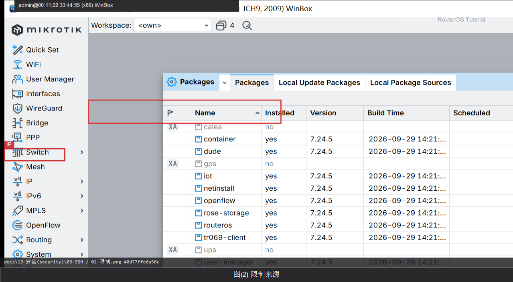

# SSH

> 适用版本：RouterOS 7.x


## 目的

用 SSH 管理并限制来源。

## 网络

- 示例 LAN：`192.168.88.0/24`，网关 `192.168.88.1`，接口 `bridge`（改成你的口）
- WAN 示例：`pppoe-out1` 或 `ether1`
- 密码示例：`********`（填你自己的管理员密码）
- 身份示例：`R1`

## 第1步：打开 Services

WinBox：`IP → Services`

动作：确认 ssh 启用。



```routeros
/ip/service/print where name=ssh
```

## 第2步：限制来源

WinBox：`IP → Services → ssh`

动作：Available From 填管理网段。



```routeros
/ip/service/set ssh address=192.168.88.0/24
```

## 检查

WinBox：SSH 可登录且来源受限

```routeros
/ip/service/print where name=ssh
```

## 常见问题

容易忽略：生产建议密钥登录。
