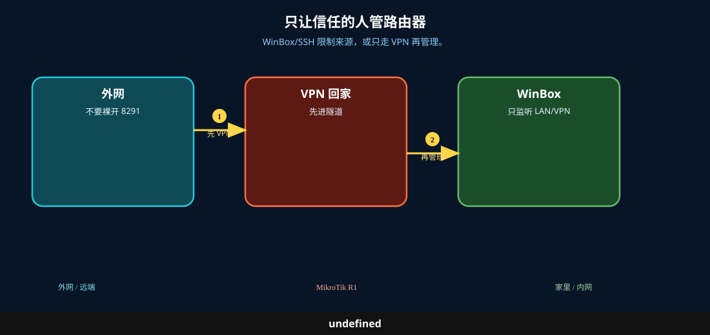

# 远程管理

> 适用版本：RouterOS 7.x

## 目的

远程优先走 VPN，再开管理。

## 网络

- 示例 LAN：`192.168.88.0/24`，网关 `192.168.88.1`，接口 `bridge`（改成你的口）
- WAN 示例：`pppoe-out1` 或 `ether1`
- 密码示例：`********`（填你自己的管理员密码）
- 身份示例：`R1`

## 先看懂

WinBox/SSH 限制来源，或只走 VPN 再管理。



## 第1步：确认 VPN

WinBox：`WireGuard`

动作：远程先连 wg，再访问管理地址。


```routeros
/interface/wireguard/print
```

## 第2步：限制管理源

WinBox：`IP → Services`

动作：WinBox/SSH Available From 含 VPN 网段。


```routeros
/ip/service/print
```

## 检查

WinBox：经 VPN 能管理，公网不裸开

```routeros
/interface/wireguard/print
/ip/service/print
```
