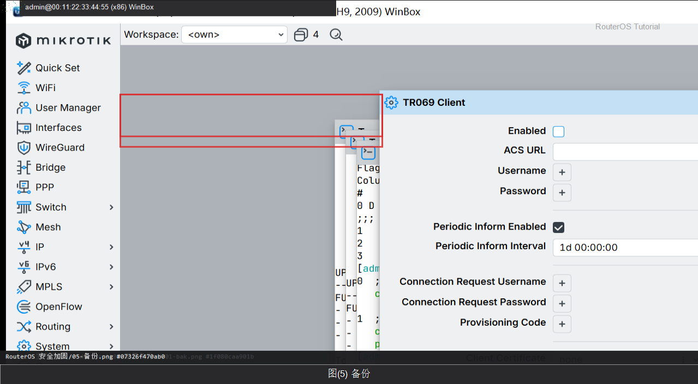

# RouterOS 安全加固

> 适用版本：RouterOS 7.x

## 目的

家庭网关上一次做完：改密、关多余服务、限制管理来源、NTP。

## 网络

- LAN：`192.168.88.0/24`，网关 `192.168.88.1`，接口 `bridge`（改成你的口）
- WAN：`pppoe-out1` 或 `ether1`
- 公网示例用 TEST-NET：`203.0.113.10`；密码只写 `********`
- 身份示例：`R1`

## 第1步：改管理员密码

WinBox：`System → Users → admin`

动作：Password 填你自己的新密码。


<p align="center">图(1) 改管理员密码</p>


```routeros
/user/set [find name=admin] password=********
```

## 第2步：关掉危险服务

WinBox：`IP → Services`

动作：Disable ftp、telnet、www（若不用 WebFig）。保留 winbox、ssh。


<p align="center">图(2) 关掉危险服务</p>


```routeros
/ip/service/disable [find name=ftp]
/ip/service/disable [find name=telnet]
/ip/service/disable [find name=www]
/ip/service/print
```

## 第3步：限制 WinBox/SSH 来源

WinBox：`IP → Services`

动作：winbox、ssh 的 Available From 填 192.168.88.0/24（需要远程时再加 VPN 网段）。


<p align="center">图(3) 限制WinBox/SSH来源</p>


```routeros
/ip/service/set winbox address=192.168.88.0/24
/ip/service/set ssh address=192.168.88.0/24
```

## 第4步：开 NTP

WinBox：`System → NTP Client`

动作：Enabled=yes，Servers=pool.ntp.org。证书和日志都依赖正确时间。


<p align="center">图(4) 开NTP</p>


```routeros
/system/ntp/client/set enabled=yes servers=pool.ntp.org
/system/clock/print
```

## 第5步：备份

WinBox：`Files`

动作：改完立刻备份，放到电脑。



<p align="center">图(5) 备份</p>


```routeros
/system/backup/save name=after-harden
```

## 检查

WinBox：危险服务为 disabled；还能用 WinBox 从 LAN 登录

```routeros
/ip/service/print
/user/print
```

## 常见问题

容易忽略：Available From 填错会把自己关在门外，改前用 Neighbors/MAC 留退路。
