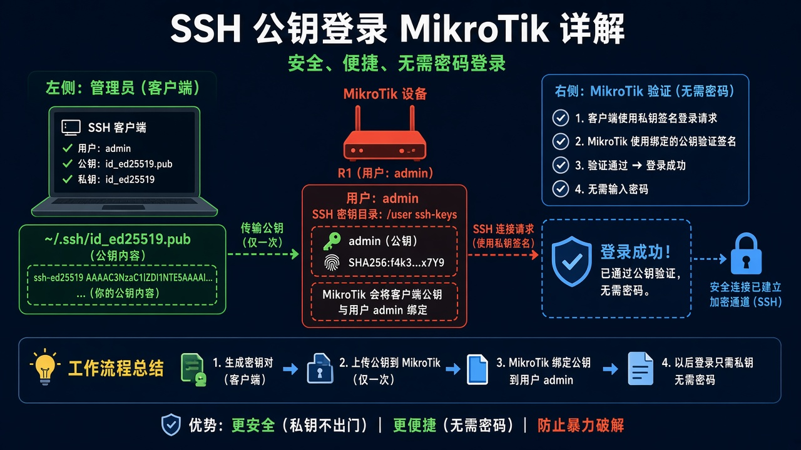
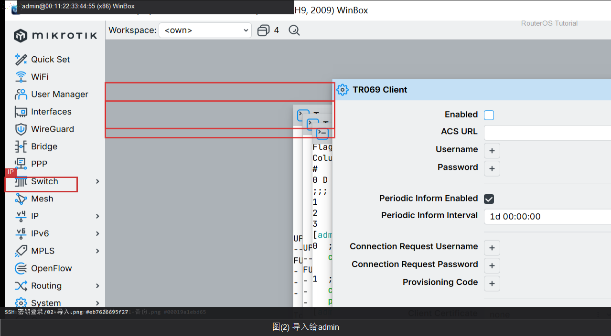
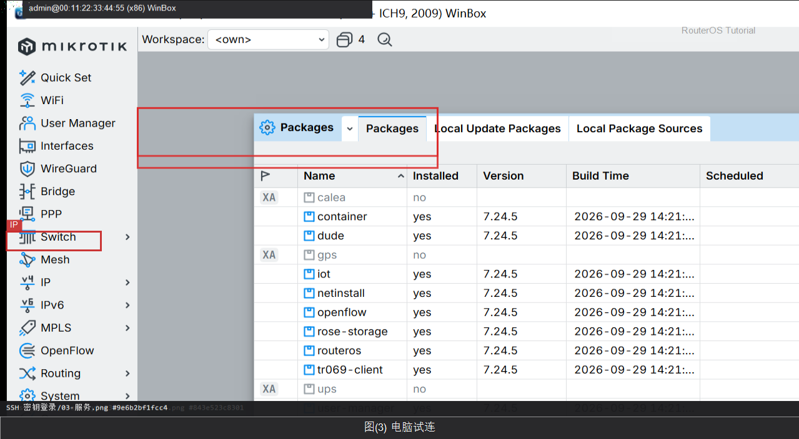

# SSH 密钥登录

> 适用版本：RouterOS 7.x

## 目的

电脑用公钥登录路由器，可关掉密码登录。

## 网络

- LAN：`192.168.88.0/24`，网关 `192.168.88.1`，接口 `bridge`（改成你的口）
- WAN：`pppoe-out1` 或 `ether1`
- 公网示例用 TEST-NET：`203.0.113.10`；密码只写 `********`
- 身份示例：`R1`
- 电脑上已有 `id_rsa.pub` 或 `id_ed25519.pub`（在电脑生成，不要在教程里贴私钥）

## 网络拓扑及原理图

电脑保存私钥，R1 只收公钥。



<p align="center">图(1) SSH密钥</p>

## 第1步：上传公钥文件

WinBox：`Files`

动作：把电脑上的 .pub 拖进 Files，例如 id_rsa.pub。


<p align="center">图(2) 上传公钥文件</p>


```routeros
/file/print where name~"pub"
```

## 第2步：导入给 admin

WinBox：`New Terminal`

动作：官方：/user ssh-keys import。User=admin。



<p align="center">图(3) 导入给admin</p>


```routeros
/user/ssh-keys/import public-key-file=id_rsa.pub user=admin
/user/ssh-keys/print
```

## 第3步：电脑试连

WinBox：`电脑终端`

动作：ssh admin@192.168.88.1 应不再问密码（或只问密钥口令）。



<p align="center">图(4) 电脑试连</p>


```routeros
/ip/service/print where name=ssh
```

## 第4步：（可选）关闭密码登录

WinBox：`IP → SSH`

动作：确认密钥能登录后，再设 password-authentication=no。官方默认 yes-if-no-key。设错会锁死，先留 MAC 登录退路。


<p align="center">图(5) （可选）关闭密码登录</p>


```routeros
/ip/ssh/set password-authentication=no
/ip/ssh/print
```

## 检查

WinBox：user ssh-keys 列表有 admin 的公钥；电脑能密钥登录

```routeros
/user/ssh-keys/print
/ip/ssh/print
```

## 常见问题

容易忽略：RouterOS 不能当 OpenSSH 那样在本机 ssh-keygen。公钥须先上传到 Files。ed25519/RSA 按官方支持列表。
