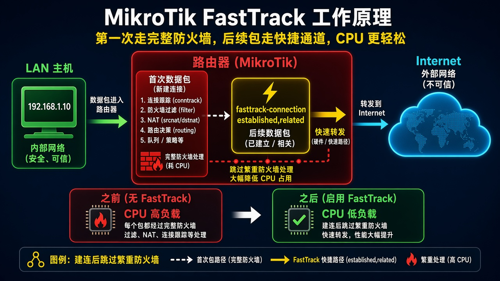
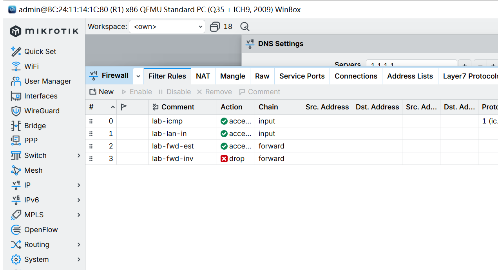

# 第 45 课：让转发走 FastTrack 少占 CPU

> 适用版本：RouterOS 7.x

## 目的

已经建连的转发少走防火墙，CPU 降下来。

## 网络

- 示例 LAN：`192.168.88.0/24`，网关 `192.168.88.1`，接口 `bridge`（改成你的口）
- WAN 示例：`pppoe-out1` 或 `ether1`
- 密码示例：`********`（填你自己的管理员密码）
- 身份示例：`R1`

放在 forward 的 drop 之前。后面还要留一条 `accept` established/related。

## 网络拓扑及原理图

新连接走完整防火墙，后续包走 FastTrack。



<p align="center">图(1) FastTrack</p>

## 第1步：打开 Filter

WinBox：`IP → Firewall → Filter Rules`

动作：看 forward 链现有规则顺序。



<p align="center">图(2) 打开Filter</p>

```routeros
/ip/firewall/filter/print
```

## 第2步：加上 FastTrack

WinBox：`IP → Firewall → Filter Rules → +`

动作：Chain=`forward`，Connection State 勾 `established` 和 `related`，Action=`fasttrack connection`，Comment=`lab-fasttrack`。拖到 forward 的 drop 前面。下面再留一条同样状态的 `accept`。


<p align="center">图(3) 添加FastTrack</p>

```routeros
/ip/firewall/filter/add chain=forward action=fasttrack-connection connection-state=established,related comment=lab-fasttrack
/ip/firewall/filter/add chain=forward action=accept connection-state=established,related comment=lab-fwd-est
```

## 检查

WinBox：上网时 lab-fasttrack 计数很快涨，CPU 比没开时低

```routeros
/ip/firewall/filter/print stats where comment=lab-fasttrack
```

## 常见问题

要做 Queue / 精细 mangle 时，被 FastTrack 的流可能绕过去。
