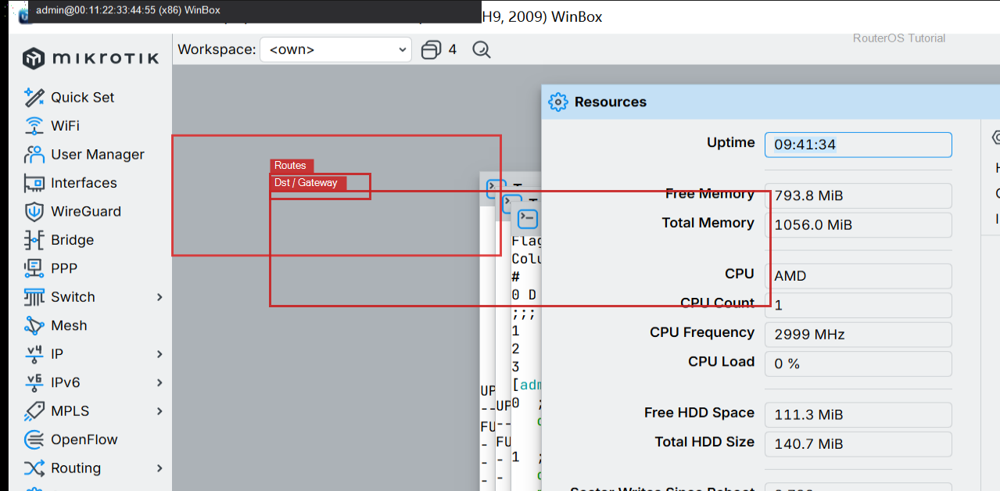
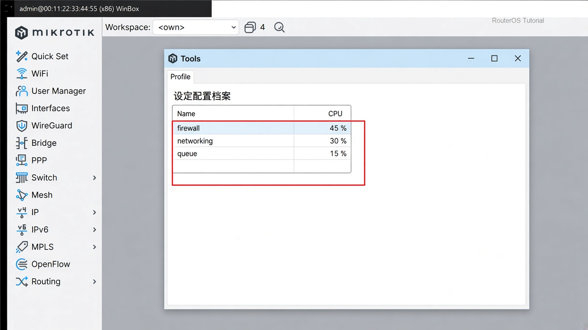

# 查看 CPU 瓶颈

> 适用版本：RouterOS 7.x

## 目的

看是哪个进程把 CPU 吃满。

## 网络

- 示例 LAN：`192.168.88.0/24`，网关 `192.168.88.1`，接口 `bridge`（改成你的口）
- WAN 示例：`pppoe-out1` 或 `ether1`
- 密码示例：`********`（填你自己的管理员密码）
- 身份示例：`R1`

## 先看懂

转发、队列、防火墙都会体现在 CPU。


<p align="center">图(1) CPU 瓶颈</p>

## 第1步：看资源

WinBox：`System → Resources`

动作：CPU 长期很高再往下查。



<p align="center">图(2) Resources</p>

```routeros
/system/resource/print
```

## 第2步：跑 Profile

WinBox：`Tools → Profile`

动作：点 Start，看占比最高的那一行（firewall、queue、networking）。



<p align="center">图(3) Profile</p>

```routeros
/tool/profile
```

## 检查

WinBox：能说出占用最高的名字

```routeros
/system/resource/cpu/print
```
