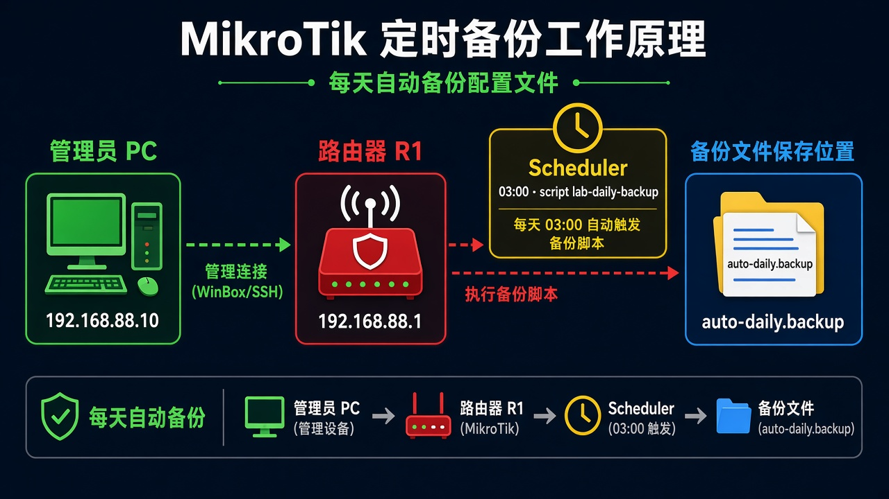

# 定时备份

> 适用版本：RouterOS 7.x

## 目的

每天生成一份 `.backup`。

## 网络

- 示例 LAN：`192.168.88.0/24`，网关 `192.168.88.1`，接口 `bridge`（改成你的口）
- WAN 示例：`pppoe-out1` 或 `ether1`
- 密码示例：`********`（填你自己的管理员密码）
- 身份示例：`R1`

文件名 `auto-daily`。备份里有密码，不要传到公开网盘。

## 网络拓扑及原理图

Scheduler 每天跑一次脚本，Files 里出现备份。



<p align="center">图(1) 定时备份</p>

## 第1步：写脚本

WinBox：`System → Scripts → +`

动作：Name=`lab-daily-backup`，Policy 勾 `sensitive`、`ftp`、`read`、`write`。Source 填备份命令。


<p align="center">图(2) 备份脚本</p>

```routeros
/system/script/add name=lab-daily-backup policy=ftp,read,write,sensitive source={/system backup save name=auto-daily}
```

## 第2步：加计划任务

WinBox：`System → Scheduler → +`

动作：Name=`lab-daily-backup`，Interval=`1d`，Start Time=`03:00:00`，On Event=`lab-daily-backup`。


<p align="center">图(3) Scheduler</p>

```routeros
/system/scheduler/add name=lab-daily-backup interval=1d start-time=03:00:00 on-event=lab-daily-backup
```

## 检查

WinBox：点一次 Run Script，Files 里有 `auto-daily.backup`

```routeros
/system/scheduler/print
/file/print where name~"auto-daily"
```

## 常见问题

脚本没跑：检查 Policy，缺 `sensitive` 时 backup 会失败。
