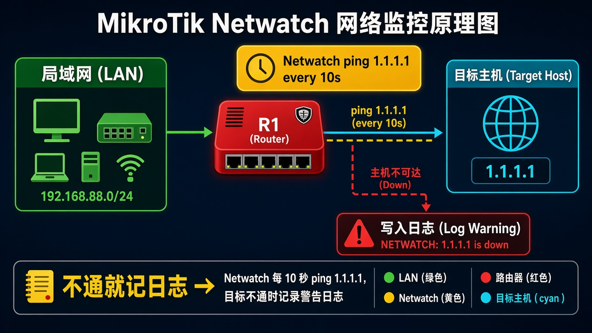

# 第 47 章：让路由器盯着外网通断再自动动作

> 适用版本：RouterOS 7.x

## 目的

盯一个地址，不通就写日志。

## 网络

- 示例 LAN：`192.168.88.0/24`，网关 `192.168.88.1`，接口 `bridge`（改成你的口）
- WAN 示例：`pppoe-out1` 或 `ether1`
- 密码示例：`********`（填你自己的管理员密码）
- 身份示例：`R1`

探测目标换成你自己要盯的地址。

## 网络拓扑及原理图

R1 定时探测，Down 时记一条 log。



<p align="center">图(1) Netwatch</p>

## 第1步：打开 Netwatch

WinBox：`Tools → Netwatch`

动作：确认窗口是 Netwatch。


<p align="center">图(2) 打开Netwatch</p>

```routeros
/tool/netwatch/print
```

## 第2步：添加探测

WinBox：`Tools → Netwatch → +`

动作：Name=`lab-gw`，Host 填要盯的地址，Type=`simple`，Interval=`10s`。Down Script 写 `/log warning lab-gw-down`。Up Script 写 `/log info lab-gw-up`。


<p align="center">图(3) 添加探测</p>

```routeros
/tool/netwatch/add name=lab-gw host=1.1.1.1 type=simple interval=10s timeout=3s down-script="/log warning lab-gw-down" up-script="/log info lab-gw-up"
```

## 检查

WinBox：Status 为 up；拔掉 WAN 后变 down，Log 有 warning

```routeros
/tool/netwatch/print
/log/print where message~"lab-gw"
```

## 常见问题

v7 旧界面没有 Type 时，默认就是 ping。
