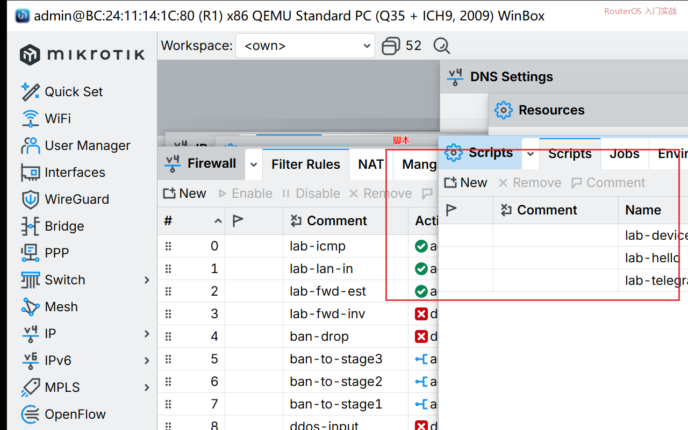
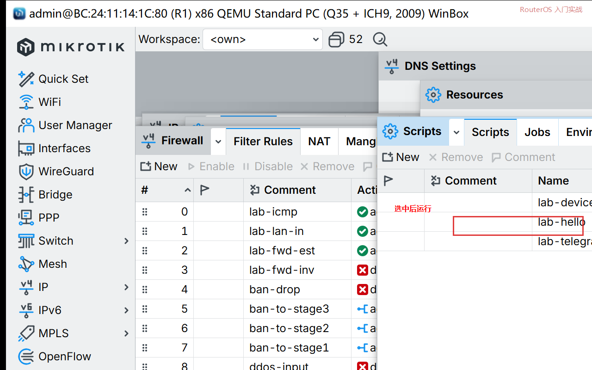

# 第 56 章：让 RouterOS 跑一段自己写的脚本

> 适用版本：RouterOS 7.x

## 目的

写一段脚本，点一下就能在日志里出现 `lab-hello`。

## 网络

- 身份示例：`R1`
- 密码示例：`********`（填你自己的管理员密码）

## 第1步：新建脚本

WinBox：`System → Scripts → +`

动作：Name=`lab-hello`。Policy 勾 `read`、`write`、`test`。Source 填下面那一行。OK。



<p align="center">图(1) 脚本</p>

```routeros
/system/script/add name=lab-hello policy=read,write,test source={:log info lab-hello}
```

## 第2步：跑一次

WinBox：还在 Scripts 窗口，选中 `lab-hello`，点 Run Script。



<p align="center">图(2) 运行</p>

```routeros
/system/script/run lab-hello
```

## 检查

WinBox：`Log`。应出现 `lab-hello`。

```routeros
/log/print where message~"lab-hello"
```
