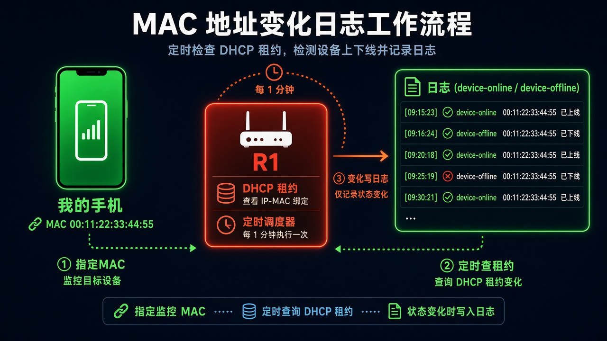
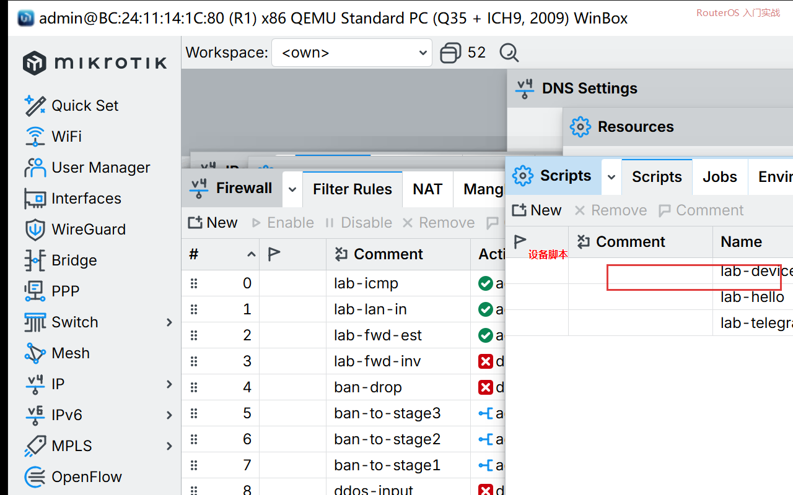
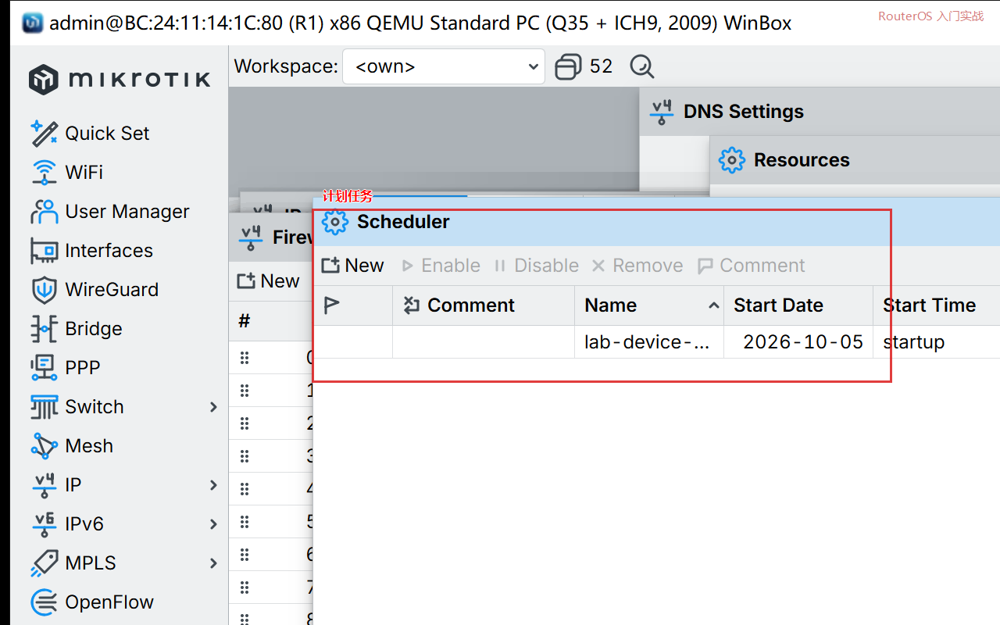

# 第 58 章：让指定设备上线下线被记下并通知你

> 适用版本：RouterOS 7.x

## 目的

指定你自己的手机 MAC，租约一变成 bound，日志里出现 `device-online`。用来看家里那台设备在不在，不是去盯别人。

## 网络

- LAN DHCP 在 `bridge`，网段 `192.168.88.0/24`
- 设备 MAC 示例：`00:11:22:33:44:55`（改成你自己那台）
- 身份示例：`R1`

## 网络拓扑及原理图

计划任务去翻 DHCP 租约。这个 MAC 在线就写 `device-online`，不在就写 `device-offline`。



<p align="center">图(1) 指定设备</p>

## 第1步：写脚本

WinBox：`System → Scripts → +`

动作：Name=`lab-device-online`。Policy 勾 `read`、`write`、`test`。Source 填下面整段。把 MAC 改成你的。



<p align="center">图(2) 脚本</p>

```routeros
/system/script/add name=lab-device-online policy=read,write,test source={:if ([:len [/ip dhcp-server lease find where mac-address=00:11:22:33:44:55 status=bound]]>0) do={:log info device-online} else={:log info device-offline}}
```

## 第2步：一分钟跑一次

WinBox：`System → Scheduler → +`

动作：Name=`lab-device-online`，Interval=`1m`，On Event=`lab-device-online`。



<p align="center">图(3) 计划</p>

```routeros
/system/scheduler/add name=lab-device-online interval=1m on-event=lab-device-online policy=read,write,test
```

## 第3步：先手动跑一次

WinBox：Scripts 里选中，点 Run Script。

```routeros
/system/script/run lab-device-online
```

## 检查

WinBox：`Log`。MAC 不在租约里应是 `device-offline`；手机连上家里 Wi-Fi 拿到地址后应是 `device-online`。

想推到手机时，把第 59 章的 Telegram 脚本接到 `device-online` 那一行后面。这一课不依赖 Telegram 也能看日志。

```routeros
/log/print where message~"device-online|device-offline"
```

## 常见问题

只认 DHCP 租约。设备用的是自己填的静态地址，这条脚本会一直认为离线。
