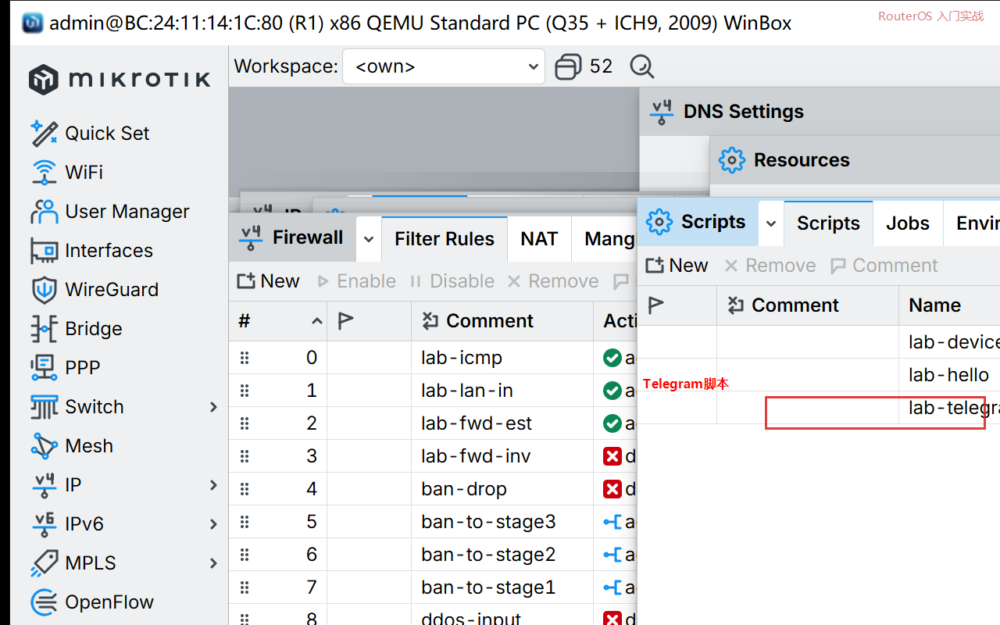

# 第 59 章：让 RouterOS 给 Telegram 发一条消息

> 适用版本：RouterOS 7.x

## 目的

路由器用 fetch 调 Telegram，手机收到一条 `hello-from-R1`。

## 网络

- 路由器能上网（已有默认路由和 DNS）
- Bot Token、Chat ID 换成你自己的。课文里只写占位 `BOTTOKEN`、`CHATID`
- 身份示例：`R1`

## 网络拓扑及原理图

R1 访问 `api.telegram.org`。Token 填错时日志是失败，用来确认脚本已经跑到 fetch。


<p align="center">图(1) Telegram</p>

## 第1步：自己做 Bot

手机打开 Telegram，找 `@BotFather`，按它的说明建一个 bot，拿到 Token。再给这个 bot 发一句任意话。Chat ID 用 `@userinfobot` 这类工具看自己的数字 ID。不要把 Token 贴进公开仓库。

## 第2步：写脚本

WinBox：`System → Scripts → +`

动作：Name=`lab-telegram`。Policy 勾 `read`、`write`、`test`、`ftp`（fetch 需要）。Source 把 `BOTTOKEN`、`CHATID` 换成你的。



<p align="center">图(2) fetch 脚本</p>

```routeros
/system/script/add name=lab-telegram policy=ftp,read,write,test source={:do {/tool fetch url="https://api.telegram.org/botBOTTOKEN/sendMessage" http-method=post http-data="chat_id=CHATID&text=hello-from-R1" keep-result=no; :log info telegram-sent} on-error={:log warning telegram-failed}}
```

## 第3步：跑一次

WinBox：点 Run Script。

```routeros
/system/script/run lab-telegram
```

## 检查

Token 是真的：手机出现 `hello-from-R1`，日志 `telegram-sent`。仍是占位符：日志 `telegram-failed`，说明路径已经走到 fetch，把 Token 换掉再跑。

```routeros
/log/print where message~"telegram"
```

## 常见问题

Policy 没勾能让 fetch 跑的项时，脚本直接失败。URL 里的 Token 前后不要有空格。
