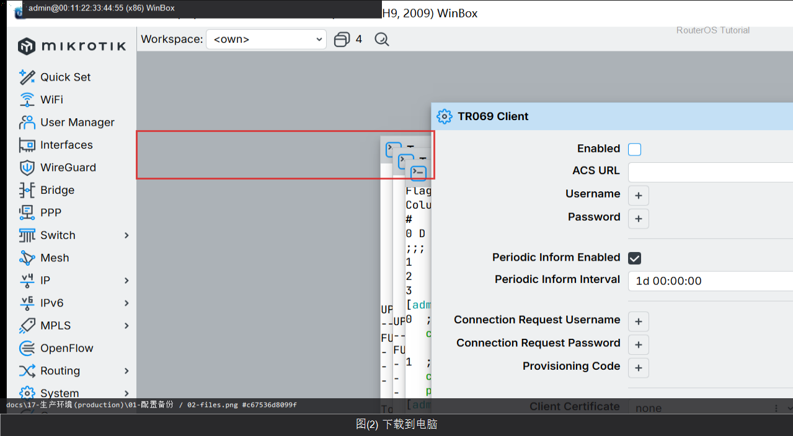

# 第 48 章：做出一份能还原的备份文件

> 适用版本：RouterOS 7.x

## 目的

生产变更前备份。

## 网络

- 示例 LAN：`192.168.88.0/24`，网关 `192.168.88.1`，接口 `bridge`（改成你的口）
- WAN 示例：`pppoe-out1` 或 `ether1`
- 密码示例：`********`（填你自己的管理员密码）
- 身份示例：`R1`

## 第1步：生成 backup

WinBox：`Files / System Backup`

动作：保存 lab-backup.backup。


<p align="center">图(1) 生成backup</p>


```routeros
/system/backup/save name=lab-backup
```

## 第2步：下载到电脑

WinBox：`Files`

动作：把文件拖到电脑妥善保存。



<p align="center">图(2) 下载到电脑</p>


```routeros
/file/print where name~"lab-backup"
```

## 检查

WinBox：本地有备份副本

```routeros
/file/print where name~"backup"
```
