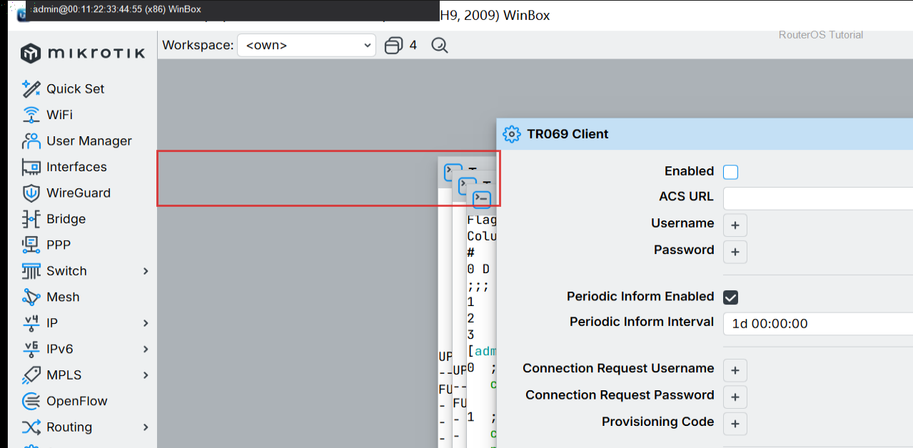

# Export 导出

> 适用版本：RouterOS 7.x

## 目的

导出可读配置文本。

## 网络

- 示例 LAN：`192.168.88.0/24`，网关 `192.168.88.1`，接口 `bridge`（改成你的口）
- WAN 示例：`pppoe-out1` 或 `ether1`
- 密码示例：`********`（填你自己的管理员密码）
- 身份示例：`R1`

## 第1步：Export 到文件

WinBox：`New Terminal`

动作：/export file=lab-export


<p align="center">图(1) Export到文件</p>


```routeros
/export file=lab-export
```

## 第2步：在 Files 查看

WinBox：`Files`

动作：确认有 lab-export.rsc



<p align="center">图(2) 在Files查看</p>


```routeros
/file/print where name~"lab-export"
```

## 检查

WinBox：Files 有 .rsc

```routeros
/file/print where name~"export"
```
